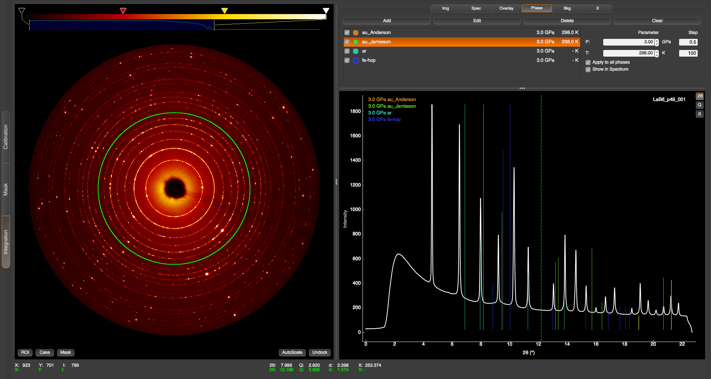
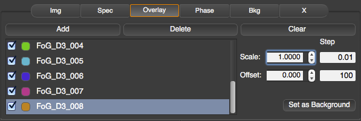
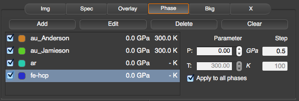
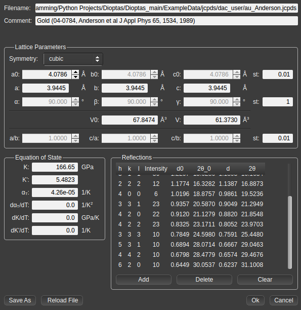
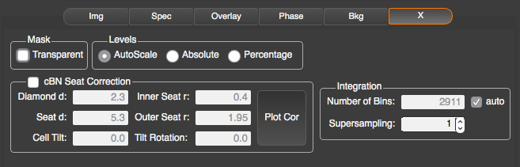

Integration Module
==================

The integration module is the heart of Dioptas. Here you can automatically integrate multiple of spectra, browse between
images and integrated spectra, compare multiple spectra to each other, perform background subtraction and compare
spectrum peak positions to the ones of known phases.

    The integration module of Dioptas.

In the integration module the current image is displayed on the left side with the integrated spectrum shown on the
lower right. The control panel has several tabs for different functions.

The "**Img**" and "**Spec**" tabs are primarily for loading and browsing images and spectra, respectively.
In the "**Overlay**" tab integrated spectra can be loaded for comparing them to the currently loaded shown active spectrum.
The "**Phase**" tab enables opening/editing jcpds files and changing the equation of state parameters of the loaded phases.
The controls in the "**Bkg**" tab can be used to define an image as background prior to integration and the "**X**"
(special) tab contains several additional optional features like cBN absorption correction, manual selection of the
number of integrating bins.

File Handling
-------------

Images and spectra can be loaded by clicking the **Load** button in the respective modules. Images can be in different
file formats: *.img*, *.sfrm*, *.dm3*, *.edf*, *.xml*, *.cbf*, *.kccd*, *.msk*, *.spr*, *.tif*, *.mccd*, *.mar3450*,
*.pnm*, or any other common image formats. Spectrum files should be 2 column files. If there is a header present it should be
commented by '#' signs.

Images loaded will be automatically integrated if a calibration is available (either by performing it in the calibration
window or by loading a previously saved calibration file (* \*.poni*) file).
There are too modes for file browsing (clicking the "**<**" and "**>**" buttons:

*By Name*:
    the next and previous filenames will be searched based on the last digits in the filename. For example the next file from
    *test_002.tif* will be *test_003.tif* and the previous will be *test_001.tif*

*By Time*:
    The next and previous files loaded will be search based on creation time of the files. This filemode does not need
    any numbers in the filenames it will just sort the files based on creation time and go forward and backwards in this
    list.

Any newly added file to the current img working directory can be opened by checking the **autoprocess** checkbox in the
Image module.

By default the integrated spectra are not saved. If you want the spectra to be saved please choose an output folder in the
**Spec** tab by clicking the "**...**" button and then check the **autoprocess** checkbox. All new integrated spectra will
then be automatically saved in this folder with name being the same as the image but different file extension.
The integrated spectra can be automatically saved in 3 different formats by checking their respective boxes in the
lower right of the **Spec** tab:

*.xy*:
    (Selected by default) A two column format with a header which contains the calibration parameters, polarization
    correction and integration unit (2th, Q or d)

*.chi*:
    A two column format with a 5 line header containing the filename, integration unit and number of points. Based on
    Fit2d output format.

*.dat*:
    A two column format without any header. It saved just the plain data.

In addition to file browsing and the "**load**" button, files can also be loaded by inserting their name folder in the
respective text fields. The upper one is the filename and the lower one is the containing folder. If the file does not
exist it the text field will revert to its previous state.

Quick Actions
~~~~~~~~~~~~~

The "**Img**" and the "**Spec**" tab exhibit several quick actions, which are basically shortcuts to some
functions:

*Save Image*:
    Saves the currently shown image as either a \*.png file for presentation or \*.tiff file as data.

*Save Spectrum*:
    Saves the current spectrum either in a two-column format (\*.xy) or the complete spectrum content in a \*.png or
    vectorized \*.svg format.

*As Overlay*:
    Adds the currently active spectrum (white) to overlays.

*As Bkg*:
    Adds the currently active spectrum (white) to overlays and sets it as background.

*Load Calibration*:
    Opens a dialog to open a *.poni calibration file and sets this as the new calibration parameters.

Overlays
--------

    Overlay controls in Dioptas.

In the overlay control panel you can add, delete or clear overlays and adjust their scaling and offset.

*Add*:
    Loads a spectrum file (2-column file) as overlay. It is possible to select multiple spectra and load them all at once.

*Delete*:
    Deletes the currently selected overlay in the overlay list.

*Clear*:
    Deletes all currently loaded overlays.

The list of overlays shows several widgets representing the state of each individual overlay.
The first checkbox controls if the overlay is visible
in the graph. The colored button shows the overlay color. Clicking on it will pop-up a color-chooser dialog where the color
for this overlay can be changed. The name of an overlay is by default its filename, but it can be modified by
double-clicking the name in the overlay list.

On the right side you can adjust the scale and offset of the overlays by either entering a specific number or using the
spin-box controls. The **step** text fields control the steps of the spin-box.

An overlay can be used as a background for the spectrum. In order to to so, you have to activate the
"**Set as Background**" button. This button sets the currently selected overlay as background for the spectrum file.
It can be seen that an overlay is set as background by the **Set as Background** button being activated for a
specific overlay and by the background overlay name being shown in the lower right of the graphical user interface
(right below the graph). The scaling and offset of the overlay/background can still be adjusted by using the respective
spin boxes.
The background overlay remains active until it is deactivated, therefore the background will be automatically subtracted
from each newly integrated image or newly loaded spectrum. If autosave for spectra is set, Dioptas will create a
*bkg_subtracted* folder in the autosave folder and automatically save all subtracted spectra.

Phases
------

    Phase controls for Dioptas

The basic controls for phases are similar to the ones in overlay:

*Add*:
    Loads a *.jcpds file, calculates the line positions in the range of the current spectrum and shows the phase lines in
    the graph. You can select multiple spectra in the file dialog.

*Edit*:
    Opens a dialog where the jcpds file can be edited. For further details see the JCPDS editor section

*Delete*:
    Deletes the currently selected phase in the phase list.

*Clear*:
    Deletes all phases.

The list of phases shows several widgets representing the state of each individual phase overlay.
The first checkbox controls if the phase lines are visible in the graph.
The colored button shows the color of the phase lines. Clicking on it will pop-up a color-chooser dialog where the color
for this phase can be changed. The name of an phase is by default its filename, but can be changed by
double-clicking the name in the phase list. Additionally the pressure and temperature for each phase is shown in the phase
list. If for a particular phase thermal expansion is not in the jcpds file it will always display '- K'.

On the right side the pressure and temperatures of the loaded phases can be adjusted. If *Apply to all phases* is checked
the pressure and temperature will be set for all loaded phases. By default the pressure and temperature values will be
displayed in the phase legend in the spectrum if they differ from ambient conditions. For disabling this feature please
uncheck the *Show in Spectrum" checkbox.

JCPDS Editor
~~~~~~~~~~~~

    Graphical JCPDS editor

In the jcpds editor the content of the jcpds file can be modified. Every change will be immediately reflected in the
position of the lines in the spectrum. You can edit the comment, the symmetry, lattice parameter and equation of state
parameters. Reflections can be edited in the reflections table. h, k, l and intensities can be modified by double
clicking in the table all other parameters are calculated correspondingly. A 0 after a parameters always means that this
is the value at ambient condition and when there is no 0 the value corresponds to the current temperature and pressure
conditions modified in the *Phase* tab.
The changes can be saved as a new file by clicking the *Save As* button. If you want to revert all changes and reload the
original files please press the *Reload File* button. If you like the changes you made you can close the JCPDS editor
either by clicking the *X* button or the *OK* button on the lower right. The *Cancel* button will close the JCPDS editor
and revert the changes made since the last opening of the JCPDS editor.

Background subtraction
----------------------

In the *Bkg* tab an image can be loaded as background image. This image will be subtracted from the original image prior
to the integration process. The intensity of the image can scaled or offset by using the corresponding spin boxes. The
text fields next to the spinboxes define the individual steps for the spinbox. After each change, loading an image as
background, removing it, or change the scale and offset of the background image, the image will be automatically
reintegrated.

*Load*:
    Loads an image as background image.

*Remove*:
    Removes the currently loaded background image. The original image will then be integrated without any background
    subtraction.

*Scale and Offset*:
    The intensity of the background image is scaled by: scale x img_intensity + offset.

Special (X-Tab)
---------------

    Special Options.

The currently available features:

*Mask - Transparent*:
    If a mask is used for integration it will be shown as transparent red over the image, compared to the usual solid red.
    This makes it possible to still be able to see what exactly is masked

*Levels - Autoscale, Absolute, Percentage*:
    These 3 choices are different modes for intensity scaling when loading new files or browsing files. *Autoscale* will
    always perform autoscaling for each newly loaded image. When using *Absolute* the maximum and minimum levels remain
    the same and are independent of the img intensities and when using *Percentage* the levels are always scaled as
    percentage of the maximum intensity of the newly loaded image.

*cBN Seat Correction*:
    Enabling this option calculates the theoretical transmitted intensity through a diamond and cBN seat based on the
    parameters entered into the text boxes. Where:
        - Diamond d is the diamond thickness in mm.
        - Seat d is the seat thickness in mm
        - Inner Seat r is the radius of the small opening of the cBN seat (close to the diamond) in mm
        - Outer Seat r is the radius of the outer opening of the cBN seat in mm
        - Cell Tilt is the tilting of the cell in respect to the primary beam in degrees.
        - Tilt Rotation is the direction of the Cell tilt in degrees.
    To see the calculated transmitted intensity distribution press the *Plot Cor* button. This will show the calculated
    absorption correction in the image view.

*Integration*:
    Here you can manually specify the number of integration bins and/or choose to supersample the image. Supersampling
    an image by a factor of n>1 results in of splitting of each pixel into n^2 pixels with equal distribution of
    intensities among the splitted pixels. For perfect powder samples this can result in smaller integrated peak widths
    and more points per peak if the physical pixel width is too high. However, it may result in unreasonable intensity
    distributions. Please use at your own risk.

