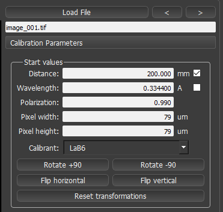
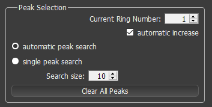
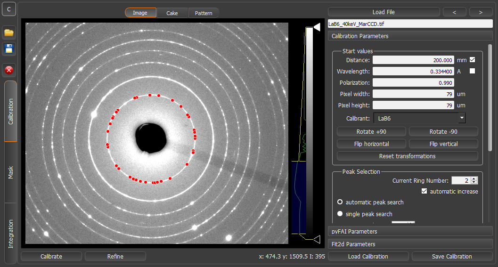

.. sectnum::
   :start: 2

Calibration Procedure
=====================
Make sure you are in the calibration mode, which should be selected on the left side of the window.

Preparation
~~~~~~~~~~~

Load the calibration image by clicking the "*Load file*" button on the upper right side of the window.
Now you can insert the starting values for the calibration in the menu on the right.
The calibration procedure will estimate distance and center position of the x-ray, as well as detector rotation.
For this procedure the wavelength and pixel width/height have to be defined based on the experimental setup and detector
used.
Please choose the correct calibrant from the Calibrant drop-down list.
In case your calibrant is not available, your own calibrant can be added in the dioptas/calibrants folder as a text file
containing a list of d-spacings, Dioptas will automatically have this calibrant available in the combobox after a
restart.
Different detector orientations can be accommodated by rotation or flipping the image.
These image transformations will be applied to all subsequent loaded images in the calibration module and in the
integration module.

   Start values for calibration

Peak Picking
~~~~~~~~~~~~

In order for Dioptas to find the correct geometry it needs an initial guess for the position of some of the rings.
This is done by selecting several peaks on each diffraction ring.
The parameters for peak selection are given in the "*Peak Selection*" section on the right site of the calibration
module, when "*Calibration Parameters*" is selected.

   Peak Selection Options

By default automatic peak search is selected, which tries to automatically find peaks on a clicked ring.
To search on the first ring please click on it with the left mouse button.
In case it is very difficult to "hit" the ring with the mouse you can just zoom in by using the drag-zoom or mouse-wheel
zoom.
If the peak search was successful it should look like this:

    LaB\ :sub:`6` \  2D diffraction image with the first ring selected.

If the automatic peak searching fails (when Dioptas fails to select other peaks on the first diffraction ring) there are
several available options:

* perform the automatic peak search on a different ring.

  - change the "*Current Ring Number*"
  - and select the a peak on this ring

* choose "*single peak search*", which will search the highest intensity peak around the click position, whereby the
    size of the search area is defined byt the *search size*

  - then search one peak for one diffraction ring (the current peak number will automatically increase)
  - or deselect the automatic increase checkbox and click several spots on the first ring, or any ring you like (with
    the corresponding peak number selected)

The Calibration and Refinement Process
~~~~~~~~~~~~~~~~~~~~~~~~~~~~~~~~~~~~~~

After the peaks/ring(s) have been selected we can start the calibration procedure.
This is done by clicking the "*Calibrate*" Button on the lower left of the interface.
This will calculate the geometric parameters based on the current peak selection and then automatically refine the
calibration parameters.

After refinement Dioptas will automatically create a 360 degree cake image and an integrated pattern.
When the procedure is finished it will jump to the "*Cake*" tab (top tab-bar above the image) and show the cake image.
In this image you can easily check if the calibration was successful (by checking if the cake lines are straight).
Additionally, the pattern is plotted with calculated calibrant positions in the "*Pattern*" Tab.
All peak maxima should coincide with phase line positions.
The resulting calibration parameters are shown by clicking the **pyFAI parameters** or **Fit2d Parameters** tabs in the
right control panel.
The current calibration parameters can be saved by clicking the **Save Calibration** button on the lower right of the
user interface.
To fast reuse the a calibration, the calibration can be reloaded by clicking **Load Calibration**.

If the calibration failed, either the start values are wrong, the initial peak selection was faulty or the refinement
parameters need to be adjusted.
For a new peak selection, just click "clear all peaks" and start the the peak selection again, make sure that current
peak number belongs to the corresponding clicked ring.
The meaning of each of the refinement options are explained in the next section.

Refinement Options
__________________

The refinement options are defined on the right control panel of the Calibration module, when "Calibration Parameters"
is selected.

.. figure:: images/refinement_options.png
    :align: center
    :width: 300 px

    Available options for calibration refinement

There are several options available:

- *automatic refinement:*
    Defines if Dioptas should search for peaks by itself after using the initially selected peaks.
    When this option is deselected only the selected peaks are used for calculating the detector calibration.

- *use mask/transparent:*
    The refinement can be constraint to a certain image area by using a mask previously defined in the mask module.
    The image of the mask can be made transparent to be able to "look behind"

- *Peaksearch algorithm:*
    The algorithm used for searching peaks on the ring.
    The standard algorithm is "Massif" although "Blob" detection may give better results in some cases.

- *Delta 2th:*
    This is the +- search range used for automatic peak search for each ring.
    The center value depends on the values, estimated by the calibration procedure, so ultimately by the initial choice
    of predefined peaks (Peak selection)

- *Intensity Min factor:*
    This factor determines how many times the peak intensity has to be higher than the mean value of the search area
    (within the delta 2th value) for each individual ring.
    The lower this value is the more peaks will be selected, however, also the likelihood of selecting wrong background
    peaks increase.
    The default value is 3, which is good for rather spotty patterns.
    If your calibration image has perfect diffraction rings, this value needs to be reduced to about 1-1.5.

- *Intensity Max:*
    A threshold value which excludes all peaks above this value.
    The default value is 55000 which is good for 16 bit detectors.
    In case a detector with more levels is used this value needs to be adjusted.

- *Number of rings:*
    The number of rings on which peaks are searched.
    This should be chosen based on the number of visible rings in the calibration image.
    For an optimal calibration all visible rings should be used.

If the calibration/refinement fails you can in principle play with all parameters.
However, the most common adjustments are the number of rings and the *Intensity Min factor*.

