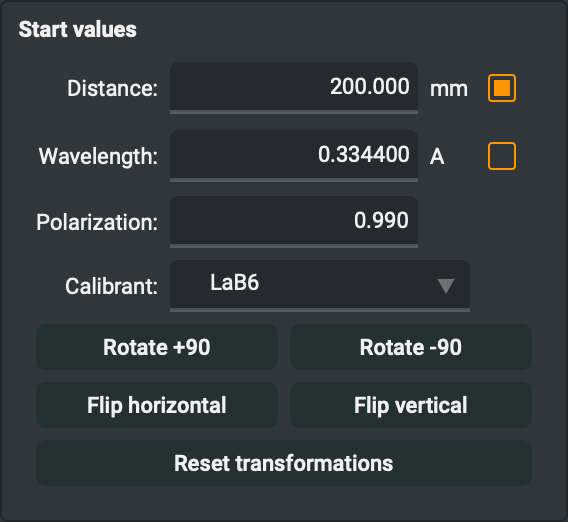
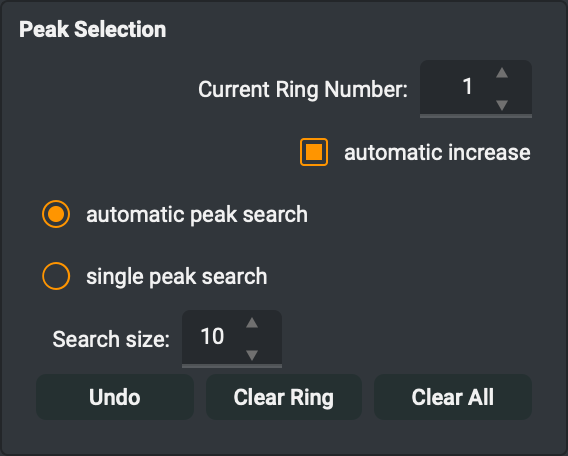
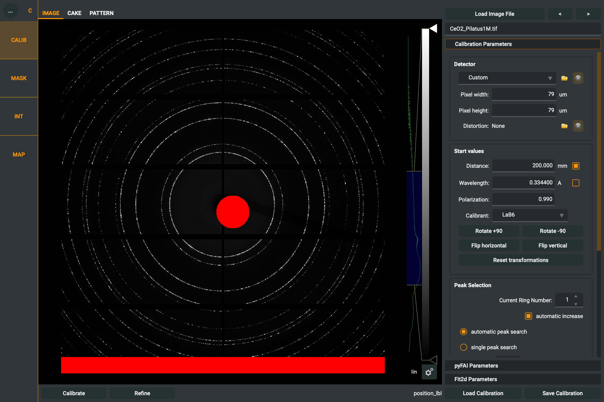
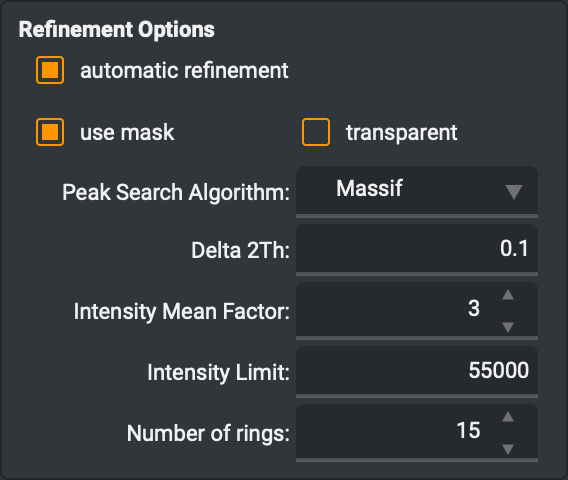

.. sectnum::
   :start: 2

Calibration Procedure
=====================
Make sure you are in the Calibration mode, selected via the **CALIB** button on the left side of the window.

Preparation
~~~~~~~~~~~

Load the calibration image by clicking the "**Load File**" button on the upper right side of the window.
Enter the starting values for the calibration in the panel on the right.
The calibration procedure will estimate distance and center position of the X-ray beam, as well as detector rotation.
The wavelength and pixel width/height must be defined based on your experimental setup and detector.

Choose the correct calibrant from the **Calibrant** drop-down list.
If your calibrant is not available, you can add your own by placing a text file containing a list of d-spacings
in the ``dioptas/calibrants`` folder. Dioptas will automatically make this calibrant available after a restart.

Different detector orientations can be accommodated by rotating or flipping the image using the
**Rotate +90**, **Rotate -90**, **Flip horizontal**, and **Flip vertical** buttons.
These image transformations will be applied to all subsequently loaded images across all modules.

You can also load a predefined detector from pyFAI's detector database or from a NeXus detector definition file.

   Start values for calibration.

Peak Picking
~~~~~~~~~~~~

In order for Dioptas to find the correct geometry, it needs initial guesses for the positions of diffraction rings.
This is done by selecting peaks on each ring.
The parameters for peak selection are given in the "**Peak Selection**" section on the right side of the calibration
module when "**Calibration Parameters**" is selected.

   Peak Selection Options.

By default, **automatic peak search** is selected, which tries to automatically find peaks along a clicked ring.
To search on the first ring, click on it with the left mouse button.
If it is difficult to click on the ring, zoom in using drag-zoom or the mouse wheel.
If the peak search was successful, the found peaks will be highlighted:

    LaB\ :sub:`6` \  2D diffraction image with the first ring selected.

If the automatic peak search fails, several options are available:

* Perform the automatic peak search on a different ring:

  - Change the "**Current Ring Number**"
  - Click on the desired ring

* Choose "**single peak search**", which finds the highest intensity peak around the click position.
  The search area size is defined by the **search size** parameter.

  - Search one peak per ring (the ring number auto-increments), or
  - Deselect auto-increment and click multiple spots on any ring

* Use **Clear Ring** to delete all peaks for the currently selected ring number, or
  **Clear All Peaks** to start over completely.

The selected ring's peaks are highlighted in the image to help verify the selection.

The Calibration and Refinement Process
~~~~~~~~~~~~~~~~~~~~~~~~~~~~~~~~~~~~~~

After peaks/rings have been selected, start the calibration by clicking the "**Calibrate**" button
on the lower left of the interface.
This calculates the geometric parameters based on the peak selection and then automatically refines them.

After refinement, Dioptas creates a 360-degree cake image and an integrated pattern.
It will switch to the "**Cake**" tab (above the image) to show the cake image.
In this view you can verify the calibration by checking if the cake lines are straight.
The "**Pattern**" tab shows the integrated pattern with calculated calibrant line positions — all peak maxima
should coincide with the phase lines.

The resulting calibration parameters are shown under the **pyFAI Parameters** or **Fit2D Parameters** tabs in the
right control panel.
Save the calibration by clicking **Save Calibration** (saves a ``.poni`` file).
To reuse a calibration, load it with **Load Calibration**.

Refinement Options
__________________

The refinement options are in the right control panel when "Calibration Parameters" is selected.

    Available options for calibration refinement.

Available options:

- *Automatic refinement:*
    When enabled, Dioptas searches for additional peaks automatically after the initial calibration.
    When disabled, only the manually selected peaks are used.

- *Use mask / transparent:*
    Constrain the refinement to a certain image area using a mask previously defined in the Mask module.
    The mask can be made transparent to see the image underneath.

- *Peak search algorithm:*
    The algorithm used for finding peaks on rings.
    "Massif" is the default; "Blob" detection may give better results in some cases.

- *Delta 2th:*
    The ± search range for automatic peak search around each ring.
    The center value is estimated from the calibration procedure.

- *Intensity Min factor:*
    How many times the peak intensity must exceed the mean intensity of the search area.
    Lower values find more peaks but risk selecting background noise.
    Default is 3 (good for spotty patterns). For smooth rings, reduce to 1–1.5.

- *Intensity Max:*
    Excludes peaks above this intensity. Default 55000 (suitable for 16-bit detectors).
    Adjust for detectors with higher dynamic range.

- *Number of rings:*
    How many rings to search for peaks on. Use all visible rings for optimal calibration.

If calibration fails, the most common adjustments are the number of rings and the Intensity Min factor.
