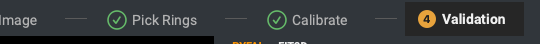
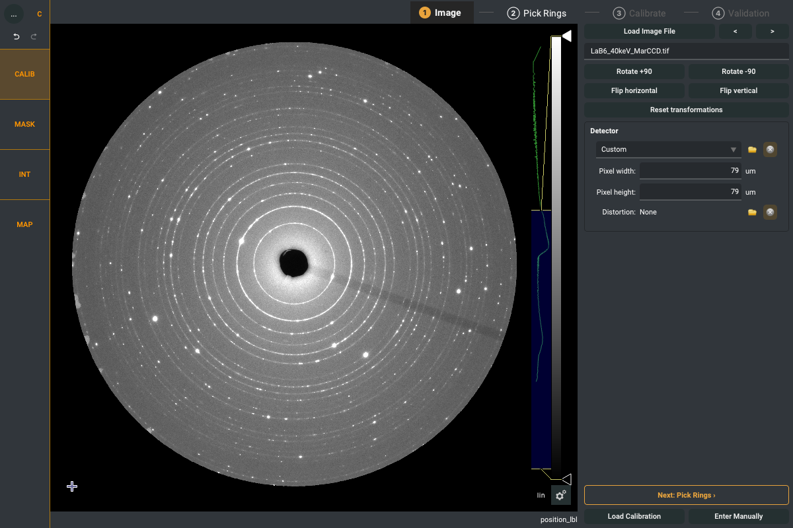
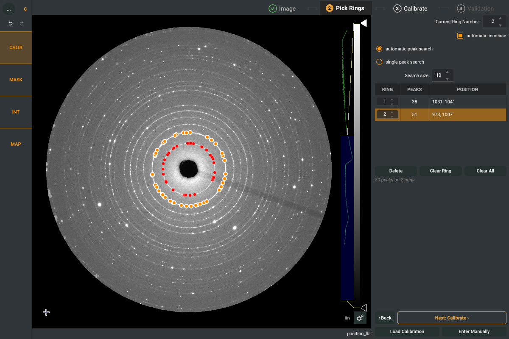
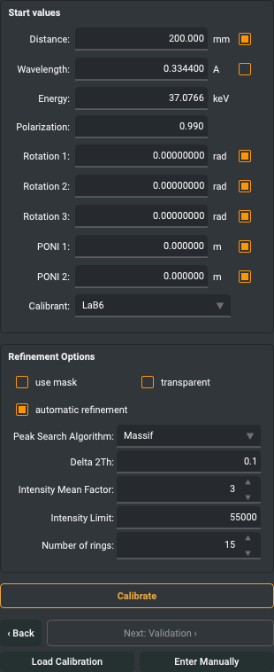
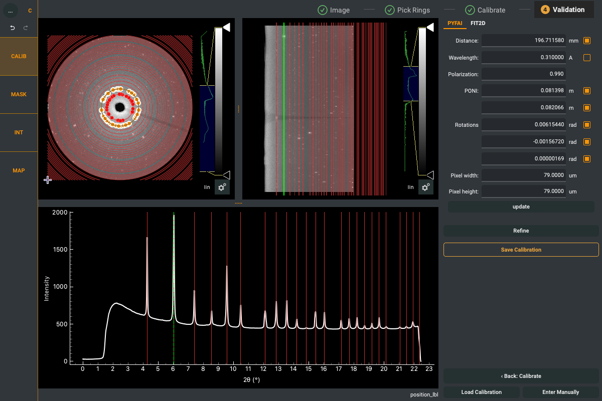

.. sectnum::
   :start: 2

Calibration Procedure
=====================
Make sure you are in the Calibration mode, selected via the **CALIB** button on the left side of the window.

Calibration is organised as a step-by-step workflow.
The stepper in the upper right corner shows the four steps and where you are:

   The calibration stepper: completed steps carry a green check mark, the current step is highlighted
   in amber, steps that are not yet reachable are greyed out.

Each step shows only the controls it needs.
Use the **Next** button at the bottom of the panel to continue — it names the step it leads to and
unlocks once the current step's prerequisites exist (an image, picked peaks, a calibration).
Completed steps can be revisited at any time by clicking them in the stepper or using **Back**.

If you already have a calibration, you do not need to walk through the steps:
**Load Calibration** (a pyFAI ``.poni`` file) and **Enter Manually** (typed pyFAI or Fit2D
parameters) at the bottom of the panel are available from every step and jump straight to the
validation step.

Values that are still at their shipped defaults — distance, wavelength, pixel size, calibrant —
are marked with an orange border until you confirm them by editing, by loading a detector or
calibration file, or by calibrating successfully.
A silently wrong default is the most common way to get a nonsense calibration, so check every
orange field before calibrating.

Step 1: Image
~~~~~~~~~~~~~

   Step 1 — load and orient the calibration image and describe the detector.

Load the calibration image with **Load Image File**.
Different detector orientations can be accommodated by rotating or flipping the image using the
**Rotate +90**, **Rotate -90**, **Flip horizontal**, and **Flip vertical** buttons.
These image transformations will be applied to all subsequently loaded images across all modules.

In the **Detector** section, either enter the pixel width and height of your detector directly,
select a predefined detector from pyFAI's detector database, or load a NeXus detector definition
file. A spline file for distortion correction can also be loaded here.

Step 2: Pick Rings
~~~~~~~~~~~~~~~~~~

In order for Dioptas to find the correct geometry, it needs initial guesses for the positions of
diffraction rings. This is done by selecting peaks on each ring — clicking on the image picks
peaks only while this step is active.

   Step 2 — LaB\ :sub:`6` \  image with peaks picked on the first two rings.
   The group of the current ring is selected in the table and highlighted in the image.

By default, **automatic peak search** is selected, which tries to automatically find peaks along a
clicked ring. To search on the first ring, click on it with the left mouse button.
If it is difficult to click on the ring, zoom in using drag-zoom or the mouse wheel.
With **automatic increase** enabled, the **Current Ring Number** advances after every successful
pick, so you can simply click ring after ring from the inside out.

Every pick becomes a row in the table, showing its ring assignment, the number of found peaks and
the mean position:

- Selecting rows highlights those peaks in the image with a white outline.
- Changing the **Current Ring Number** highlights every group belonging to that ring.
- The ring spinbox in a row reassigns the group to a different ring — useful when a ring was
  skipped or double-clicked.
- **Delete** (or the Del key) removes the selected groups. To remove a complete ring, change the
  current ring number to select all of its groups, then press **Delete**. **Clear All** starts over.

If the automatic peak search fails, choose **single peak search**, which finds the highest
intensity peak around the click position (the search area is defined by the **search size**
parameter). Either search one peak per ring with automatic increase, or deselect it and click
multiple spots on the same ring.

Step 3: Calibrate
~~~~~~~~~~~~~~~~~

   Step 3 — start values, fit constraints and refinement options.

Enter the **start values** for the calibration:

- *Distance*: approximate sample–detector distance. The checkbox next to it controls whether the
  distance is refined; unchecked, it is held fixed at the entered value.
- *Wavelength* / *Energy*: the two fields are kept in sync — enter whichever you know. The
  checkbox enables refining the wavelength (usually it is known and stays fixed).
- *Polarization*: polarization factor used for the integration.
- *Rotation 1–3* and *PONI 1/2*: the pyFAI geometry parameters. They are normally refined
  (checkbox checked); uncheck a parameter to hold it fixed at the entered value during
  calibration and refinement, e.g. to force an orthogonal geometry with all rotations at 0.
  After a successful calibration the fields show the fitted values.
- *Calibrant*: choose the correct calibrant from the drop-down list. If your calibrant is not
  available, you can add your own by placing a text file containing a list of d-spacings in the
  ``dioptas/calibrants`` folder. Dioptas will automatically make this calibrant available after a
  restart.

The **refinement options** control what happens after the initial geometry fit:

- *Use mask / transparent*:
    Constrain the refinement to a certain image area using a mask previously defined in the Mask
    module. The mask can be made transparent to see the image underneath.

- *Automatic refinement*:
    When enabled (the default), Dioptas searches for additional peaks on all rings after the
    initial calibration and refines the geometry with them. When disabled, only the manually
    picked peaks are used. Its parameters are shown while it is enabled:

    - *Peak Search Algorithm*: "Massif" is the default; "Blob" detection may give better results
      in some cases.
    - *Delta 2th*: the ± search range for automatic peak search around each ring.
    - *Intensity Mean Factor*: how many times the peak intensity must exceed the mean intensity
      of the search area. Lower values find more peaks but risk selecting background noise.
      Default is 3 (good for spotty patterns); for smooth rings, reduce to 1–1.5.
    - *Intensity Limit*: excludes peaks above this intensity. Default 55000 (suitable for 16-bit
      detectors); adjust for detectors with higher dynamic range.
    - *Number of rings*: how many rings to search for peaks on. Use all visible rings for optimal
      calibration.

Press **Calibrate** to run the calibration.
If it fails, the most common adjustments are the number of rings and the Intensity Mean Factor.

Step 4: Validation
~~~~~~~~~~~~~~~~~~

After the calibration (or after loading a ``.poni`` file), Dioptas switches to the validation
step, which shows the detector image, the 360-degree cake and the integrated pattern side by side:

   Step 4 — image, cake and pattern with the calibrant's reflections overlaid (red) and the
   linked position marker (green) after a click in the pattern.

Judging the calibration:

- The calibrant's reflections are overlaid in every view — as rings on the image, vertical lines
  in the cake and vertical lines in the pattern. Each reflection carries the same ring number used
  while picking peaks. The labels stay inside the visible area while zooming, which makes it easier
  to identify a partly visible ring. For a good calibration the overlays coincide with the measured
  rings, the cake lines are straight, and all peak maxima match the line positions.
- Clicking in any of the three views places a green marker at the same 2θ position in all of
  them: the iso-2θ ring on the image, a vertical line in the cake and the position line in the
  pattern. This makes it easy to check a specific feature across the views.
- Phases loaded in the Integration module are not shown here, keeping the validation views
  focused on the selected calibrant.

The **lines** checkbox below the views hides all calibrant overlays. The **numbers** checkbox hides
only their ring labels and remains available while the lines are shown. These controls are present
on every calibration step, not only Validation.

The resulting geometry is shown in the **pyFAI** and **Fit2D** tabs of the panel and can be
edited there; **update** applies typed values. Dioptas remembers the last selected parameter tab
for the project and the next session.
**Refine** repeats the automatic peak search and refinement based on the current geometry —
useful after adjusting parameters or the refinement options.

Finally, save the calibration with **Save Calibration** (a pyFAI ``.poni`` file), so it can be
reused later with **Load Calibration**.

Entering a Known Calibration
~~~~~~~~~~~~~~~~~~~~~~~~~~~~

Two shortcuts skip the calibration procedure entirely:

- **Load Calibration** loads a pyFAI ``.poni`` file and jumps to the validation step.
- **Enter Manually** opens the validation step with empty pyFAI/Fit2D parameter fields. Type the
  known values and press **update** — from then on the calibration behaves exactly as a
  calibrated one, including integration in the other modules.
