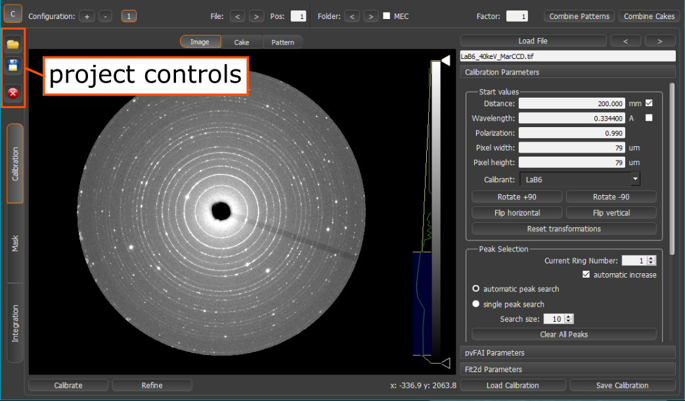

.. sectnum::
   :start: 5

===========================
Configurations and Projects
===========================

Configurations
--------------
.. _configuration_controls:

.. figure:: images/integration_view_configuration.png
    :align: center
    :width: 750 px

    Location of configuration controls.

Configuration are used to handle experimental setups with multiple detectors in one Dioptas instance. A configuration
contains the calibration information, loaded image, image corrections, mask, integrated pattern and background
corrections. Overlays and phases are not handled in configurations and are global. By default the configuration control
panel (:numref:`configuration_controls`) is hidden and only one configuration is active (single Detector mode).
To enable the panel, please click the **C** button on the upper left corner of Dioptas. In principle, Dioptas can handle
infinite configurations, however, this also means a lot of RAM usage.

A configuration can be added or removed by the **+** and **-** buttons. Each added will be subsequently numbered and
can be selected by the buttons to the left of the **-** button. After adding a a new configuration the configuration
will be empty and needs to be newly calibrated for the wanted detector geometry.

The *File* and *Folder* controls in the middle of the configuration panel enable combined file browsing for all
configurations, whereas the Pos textfield defines the position of the number in the string. By using the "**<**" and
"**>**" buttons the next or previous image in each configuration will be loaded.

This is also true for the similar *Folder* "**<**" and "**>**" buttons.
Here Dioptas supposes that the actual filenames stay the same, but the images are saved in subsequently indexed folders,
like e.g. "run101", "run102".
The MEC checkbox enables a special mode for the matters at extreme conditions beamline at LCLS where both, the folder
and the filenames have the run number included.

The Factor Input is an intensity scaling factor for the image in the configuration, so that different configurations can
be compared where the detector response is not equal.

**Combine Patterns**:Attempts to combine integrated patterns from all configurations, when selected.
    If there is overlap between the different configurations, the intensity will be averaged.

**Combine Cakes**: Attempts to combine integrated cakes from all configurations, when selected.
    If there is overlap between the different configurations (which is in principle not possible in a multi detector
    setup), the intensity will be averaged.

Dioptas Projects
----------------

.. _project_controls:

    Location of the project controls

The state of Dioptas including the different configurations with image, mask, image corrections, background corrections
overlays and phases can be open and saved in projects. This is very useful in case you want to continue working on a
project another day. The controls for this are in the upper left of the Dioptas window (see :numref:`project_controls`).
The Dioptas project files have a \*.dio extension and are basically HDF5 under the hood. Thus, can the data can be also
opened or edited with any HDF5 viewer.

Opens a file browser where you can select a Dioptas project (\*.dio) to open.

Saves the current state of Dioptas into a Dioptas project (\*.dio).

Resets the current state of Dioptas. This means all phases, overlays, and configurations will be deleted and you can
start from a new fresh Dioptas.
