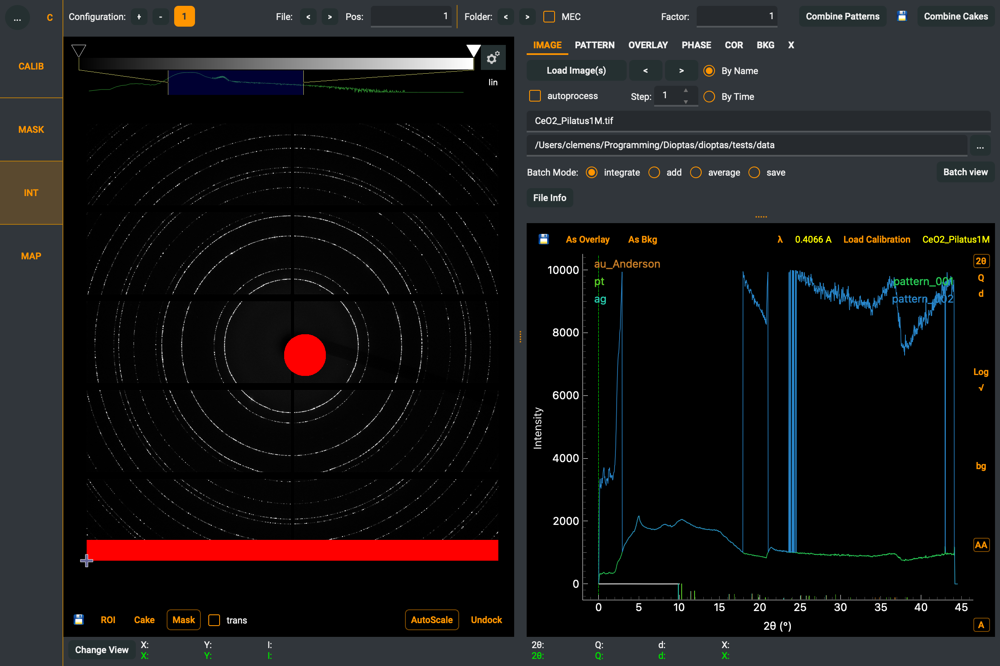
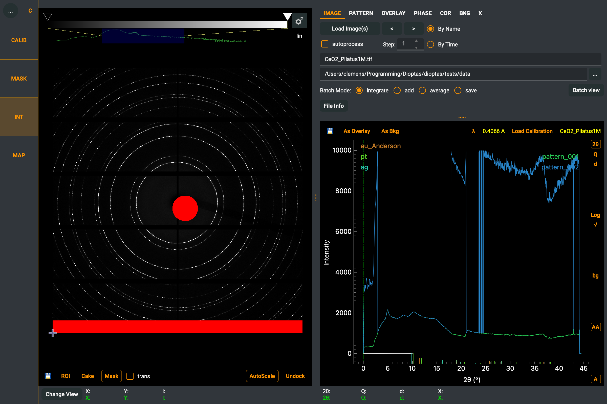

.. sectnum::
   :start: 5

===========================
Configurations and Projects
===========================

Configurations
--------------
.. _configuration_controls:

    Location of configuration controls.

Configurations are used to handle experimental setups with multiple detectors in a single Dioptas instance.
A configuration contains the calibration, loaded image, image corrections, mask, integrated pattern, and
background settings.
Overlays and phases are **not** part of configurations — they are global across all configurations.

By default, the configuration control panel (:numref:`configuration_controls`) is hidden and only one
configuration is active (single detector mode).
To show the panel, click the **C** button in the upper left corner of Dioptas.
Dioptas can handle any number of configurations, though each one uses additional memory.

Managing Configurations
~~~~~~~~~~~~~~~~~~~~~~~

- **+** button: Add a new configuration. The new configuration inherits the calibration from the current one.
- **-** button: Remove the current configuration.
- **Numbered buttons**: Switch between configurations.

Each configuration is independent — it has its own image, calibration, mask, and corrections.

Combined File Browsing
~~~~~~~~~~~~~~~~~~~~~~

The **File** and **Folder** controls in the configuration panel enable synchronized file browsing
across all configurations:

- The **<** and **>** buttons load the next/previous image in each configuration simultaneously.
- The **Pos** field specifies which number in the filename to iterate (useful for filenames with
  multiple numbers).
- The **Folder** buttons navigate between sequentially numbered folders (e.g., ``run101``, ``run102``).
- The **MEC** checkbox enables a special mode for the MEC beamline at LCLS where both folder and
  filenames contain run numbers.

The **Factor** input scales the image intensity for a configuration, allowing comparison between
detectors with different sensitivities.

Combining Patterns and Cakes
~~~~~~~~~~~~~~~~~~~~~~~~~~~~~

- **Combine Patterns**: Combines integrated patterns from all configurations using pyFAI's MultiGeometry
  for proper weighted averaging. Overlapping regions are correctly handled.
- **Combine Cakes**: Combines 2D cake images from all configurations similarly.

Dioptas Projects
----------------

.. _project_controls:

    Location of the project controls.

The complete state of Dioptas — all configurations with their images, masks, calibrations, corrections,
background settings, as well as overlays and phases — can be saved and restored as project files.
This allows you to continue work on a different day or share your analysis setup.

Project files use the ``.dio`` extension and are HDF5 files under the hood, so they can also be
inspected with any HDF5 viewer.

The project controls are in the upper left of the Dioptas window (:numref:`project_controls`):

**Open**: Load a Dioptas project (``.dio``) file, restoring the complete state.

**Save**: Save the current state to a ``.dio`` project file.

**Reset**: Clear everything and start fresh — all phases, overlays, and configurations are removed.

Using Projects with the Scripting API
~~~~~~~~~~~~~~~~~~~~~~~~~~~~~~~~~~~~~

Project files can also be loaded by the :doc:`scripting API <scripting_api>` for headless batch processing:

.. code-block:: python

    from dioptas.pipeline import Pipeline

    p = Pipeline.from_project("experiment.dio")
    patterns = p.integrate_batch("data/*.tif")

This restores the full setup (calibration, mask, corrections, orientation) and enables integration
without the GUI. See :doc:`scripting_api` for details.
