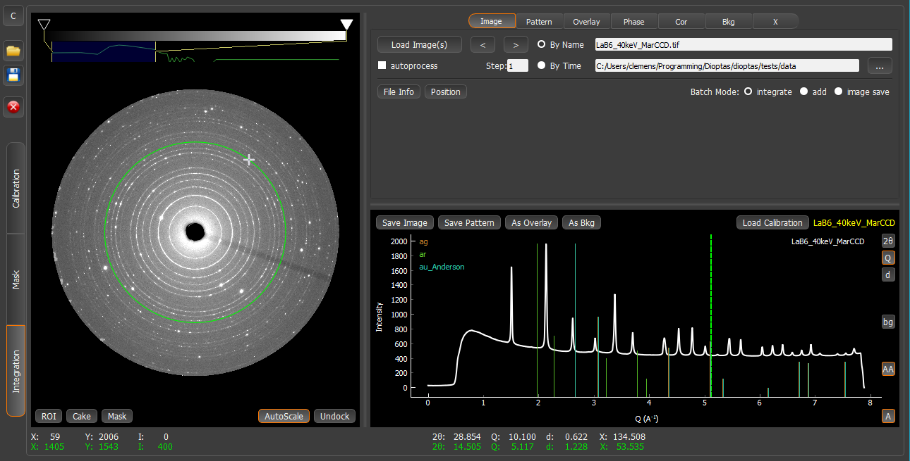
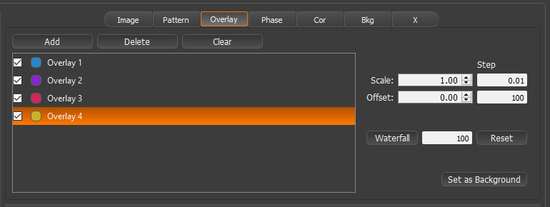
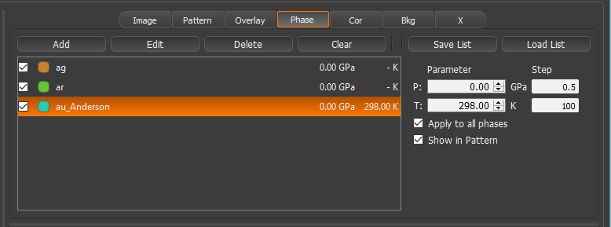
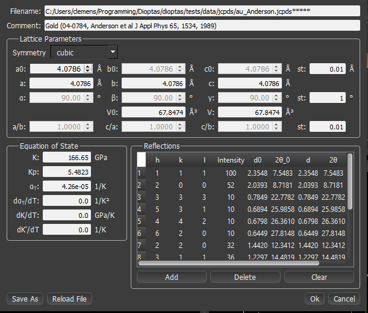
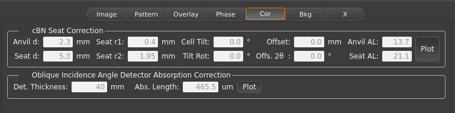
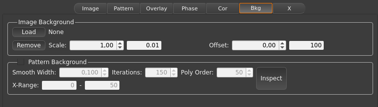
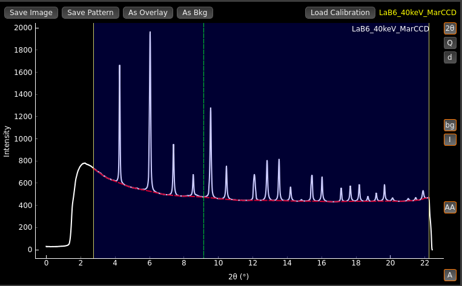
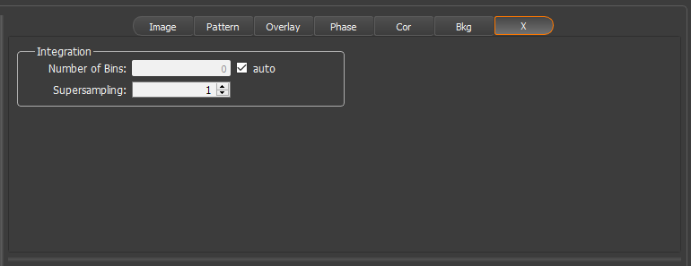
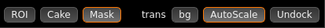

.. sectnum::
   :start: 4

==================
Integration Module
==================

The integration module is the heart of Dioptas.
Here you can automatically integrate multiple images to pattern, browse between images and integrated pattern,
compare multiple pattern to each other, perform background subtraction and compare pattern peak positions and
intensities to the ones of known phases.

    The integration module of Dioptas.

In the integration module the current image is displayed on the left side with the integrated pattern shown on the
lower right.
The control panel has several tabs for different functions.

The "**Img**" and "**Pattern**" tabs are primarily for loading and browsing images and pattern, respectively.
In the "**Overlay**" tab integrated pattern can be loaded for comparing them to the currently loaded shown active
pattern.
The "**Phase**" tab enables opening/editing jcpds files and changing the equation of state parameters of the loaded
phases.
The "**Cor**" tab gives options for performing intensity corrections.
Here the absorption of a c-BN seat and diamond in a diamond anvil cell, or the detector scintillator can be corrected
prior to integration.
The controls in the "**Bkg**" tab can be used to define an image as background prior to integration and doing automatic
background subtraction of the integrated pattern.
The "**X**" (special) tab contains several additional optional features like cBN absorption correction, manual selection
of the number of integrating bins.

File Handling
-------------

Images and pattern can be loaded by clicking the **Load** button in the respective modules.
Images can be in different file formats: *.img*, *.sfrm*, *.dm3*, *.edf*, *.xml*, *.cbf*, *.kccd*, *.msk*, *.spr*,
*.tif*, *.mccd*, *.mar3450*, *.pnm*, or any other common image formats.
Pattern files should be 2 column files.
If there is a header present it should be commented by '#' signs.

Images loaded will be automatically integrated if a calibration is available (either by performing it in the calibration
window or by loading a previously saved calibration file (* \*.poni*) file).
There are too modes for file browsing (clicking the "**<**" and "**>**" buttons):

*By Name*:
    the next and previous filenames will be searched based on the last digits in the filename.
    For example the next file from *test_002.tif* will be *test_003.tif* and the previous will be *test_001.tif*

*By Time*:
    The next and previous files loaded will be search based on creation time of the files.
    This filemode does not need any numbers in the filenames it will just sort the files based on creation time and go
    forward and backwards in this list.

In case you want to browse through files in larger steps the "*step*" value can be adjusted.
Any newly added file to the current img working directory can be opened automatically by checking the **autoprocess**
checkbox in the Image module.

By default the integrated pattern is not saved.
To automatically save the integrated patterns choose an output folder in the **Pattern** tab by clicking the "**...**"
button and then check the **autocreate** checkbox.
All new integrated patterns will then be automatically saved in this folder with name being the same as the image but
different file extension.
The integrated pattern can be automatically saved in 4 different formats by checking their respective boxes in the
lower right of the **Pattern** tab:

- *.xy*:
    (Selected by default) A two column format with a header which contains the calibration parameters, polarization
    correction and integration unit (2th, Q or d)

- *.chi*:
    A two column format with a 5 line header containing the filename, integration unit and number of points.
    Based on Fit2d output format.

- *.dat*:
    A two column format without any header.
    It saved just the plain data.

- *.fxye*:
    A three column format used by GSAS and GSAS-II.
    The third column is the error of the intensity which is usually defined as square root of the integrated intensity.

In addition to file browsing and the "**load**" button, files can also be loaded by inserting their name and folder in
the respective text fields.
The upper one is the filename and the lower one is the containing folder.
If the file does not exist it the text field will revert to its previous state.

Overlays
--------

    Overlay controls in the integration window.

In the overlay control panel you can add, delete or clear overlays and adjust their scaling and offset.

- *Add*:
    Loads a pattern file (2-column file) as overlay.
    It is possible to select multiple pattern and load them all at once.

- *Delete*:
    Deletes the currently selected overlay in the overlay list.

- *Clear*:
    Deletes all currently loaded overlays.

The list of overlays shows several widgets representing the state of each individual overlay.
The first checkbox controls if the overlay is visible in the graph.
The colored button shows the overlay color.
Clicking on it will pop-up a color-chooser dialog where the color for this overlay can be changed.
The name of an overlay is by default its filename, but it can be modified by double-clicking the name in the overlay
list.

On the right side you can adjust the scale and offset of the overlays by either entering a specific number or using the
spin-box controls.
The **step** text fields control the steps of the spin-box.

Set as Background
~~~~~~~~~~~~~~~~~

An overlay can be used as a background for the integrated pattern.
In order to to so, you have to activate the "**Set as Background**" button.
This button sets the currently selected overlay as background for the pattern file.
It can be seen that an overlay is set as background by the **Set as Background** button being activated for a
specific overlay and by the background overlay name being shown in the lower right of the graphical user interface
(right below the graph).
The scaling and offset of the overlay/background can still be adjusted by using the respective spin boxes.
The background overlay remains active until it is deactivated, therefore the background will be automatically subtracted
from each newly integrated image or newly loaded pattern.
If autosave for pattern is set, Dioptas will create a *bkg_subtracted* folder in the autosave folder and automatically
save all subtracted patterns.

Waterfall
~~~~~~~~~

The *Waterfall* button will automatically adjust the offset of all loaded overlays to a multiple of the text box to the
right of it.
This creates a waterfall plot of all overlays.
The *Reset* button resets all overlay offset to zero.

Phases
------

    Phase controls in the integration window.

The basic controls for phases are similar to the ones in overlay:

- *Add*:
    Loads a \*.jcpds or \*.cif file, calculates the line positions in the range of the current pattern and shows the
    phase lines in the graph.
    Cif-files will be internally converted into the jcpds format.
    For doing so, a small window will pop-up asking which intensity should be the minimum intensity for each reflection
    (*Intensity Cutoff*) and up to which minimum d-spacing the reflections should be included (*Minimum d-spacing*).
    You can select multiple \*.jcpds or \*.cif files in the file dialog to load multiple phases.

- *Edit*:
    Opens a dialog where the jcpds file can be edited.
    For further details see the JCPDS editor section

- *Delete*:
    Deletes the currently selected phase in the phase list.

- *Clear*:
    Deletes all phases.

- *Save List*:
    Saves a list of phases (basically a text file with the path to all phases loaded) which can be later restored.

- *Load List*:
    Loads a list of phases which was previously saved by the *Save List* function.

The list of phases shows several widgets representing the state of each individual phase overlay.
The first checkbox controls if the phase lines are visible in the graph.
The colored button shows the color of the phase lines.
Clicking on it will pop-up a color-chooser dialog where the color for this phase can be changed.
The name of an phase is by default its filename, but can be changed by double-clicking the name in the phase list.
Additionally the pressure and temperature for each phase is shown in the phase list.
If for a particular phase thermal expansion is not in the jcpds file it will always display '- K'.

On the right side the pressure and temperatures of the loaded phases can be adjusted.
If *Apply to all phases* is checked the pressure and temperature will be set for all loaded phases.
By default the pressure and temperature values will be displayed in the phase legend in the pattern if they differ from
ambient conditions.
For disabling this feature please uncheck the *Show in Pattern* checkbox.

JCPDS Editor
~~~~~~~~~~~~

    Graphical JCPDS editor.

In the *JCPDS Editor* the parameters of the jcps phase can be modified.
Every change will be immediately reflected in the position of the lines in the pattern.
You can edit the comment, the symmetry, lattice parameter and equation of state parameters.
Reflections can be edited in the reflections table.
h, k, l and intensities can be modified by double clicking in the
table all other parameters are calculated correspondingly.
A "0" after a parameter name always means that this is the value at ambient condition and when there is no "0" the value
corresponds to the current temperature and pressure conditions modified in the *Phase* tab.
The changes can be saved as a new file by clicking the *Save As* button.
If you want to revert all changes and reload the original files please press the *Reload File* button.
If you like the changes you made you can close the JCPDS editor either by clicking the *X* button or the *OK* button on
the lower right.
The *Cancel* button will close the JCPDS editor and revert the changes made since the last opening of the JCPDS editor.

Corrections
-----------

    Correction controls in the integration window.

In the *Cor* tab it is possible to enable intensity corrections for cBN seats, diamonds and the scintillator thickness
of the detector.

cBN Seat Correction
~~~~~~~~~~~~~~~~~~~
Enabling this option calculates the theoretical transmitted intensity through a diamond and cBN seat based on the
parameters entered into the text boxes.
Where:

- *Anvil d*:
    anvil thickness in :math:`mm`.
- *Seat d*:
    seat thickness in :math:`mm`
- *Inner Seat r*:
    radius of the small opening of the cBN seat (close to the diamond) in :math:`mm`
- *Outer Seat r*:
    radius of the outer opening of the cBN seat in :math:`mm`
- *Cell Tilt*:
    tilting of the cell in respect to the primary beam in degrees.
- *Tilt Rot*:
    direction of the Cell tilt in degrees.
- *Offset*:
    offset of the sample position from the center of the diamond - seat assemblage in :math:`mm`
- *Offs. Rot*:
    defines the rotation of the center offset
- *Anvil AL*:
    Absorption length of the anvil in :math:`\mu m`
- *Seat AL*:
    Absorption length of the seat in :math:`\mu m`

To see the calculated transmitted intensity distribution press the *Plot* button.
This will show the calculated absorption correction in the image view.

Oblique Incidence Angle Detector Absorption Correction
~~~~~~~~~~~~~~~~~~~~~~~~~~~~~~~~~~~~~~~~~~~~~~~~~~~~~~
Enabling this option will correct the intensity response of the detector for large angles.
The intensity is proportional to the path length of the diffracted x-ray beam through the scintillator of the
detector.
This causes higher intensities at larger angles between the diffracted beam and the normal of the detector plane
due to larger path lengths.
The correction assumes that the source of the intensity is coming from the calibrated sample position.
This correction is not valid if there is additional contribution from air or other background.
The background contribution needs to be either removed first or the correction needs to be applied to
the sample *and* the background signal before subtraction.

Parameters:

- *Det. Thickness*:
    Thickness of the detector scintillator in :math:`mm`
- *Abs. Length*:
    Absorption length of the detector scintillator in :math:`\mu m`

To see the calculated intensity correction press the *Plot* button.
This will show the calculated absorption correction in the image view.

Background subtraction
----------------------

    Background controls in the integration window.

In the *Bkg* tab an image can be loaded as background image or we can automatically subtract an estimated background
from the integrated pattern.

Image Background
~~~~~~~~~~~~~~~~

This image will be subtracted from the original image prior to the integration process.
The intensity of the image can scaled or offset by using the corresponding spin boxes.
The text fields next to the spin boxes define the individual steps for the spinbox.
After each change, loading an image as background, removing it, or change the scale and offset of the background
image, the image will be automatically reintegrated.

- *Load*:
    Loads an image as background image.

- *Remove*:
    Removes the currently loaded background image.
    The original image will then be integrated without any background subtraction.

- *Scale and Offset*:
    The intensity of the background image is scaled by: scale x img_intensity + offset.

Pattern Background
~~~~~~~~~~~~~~~~~~

Activating this, will automatically try to estimate the background in the integrated pattern using a moving average
method. The background will then be created by fitting the resulting pattern with a polynomial.

- *Smooth Width*:
    Defines the width of the moving window. The unit is based on the selection in the pattern plot
    (:math:`2\theta`, :math:`Q` or :math:`d`).
- *Iterations*:
    Number of times the moving averages filter goes through the pattern.
- *Poly Order*:
    The order of the polynomial which is fitted after the moving average filter.
- *X-Range*:
    Defines the minimum and maximum x-value of the pattern used for background subtraction.
    **CAUTION** the subtracted pattern will only be displayed in this range.

- *Inspect*:
    This button enables the inspection mode in the pattern widget (see :numref:`background_inspect_figure`).
    Enabling this mode shows the original pattern and the subtracted pattern (red dashed line).
    This is very useful to tweak the background subtraction parameters to the specific needs of the pattern.
    Furthermore, the x-range can be adjusted visually by dragging the ROI (solid yellow lines).

.. _background_inspect_figure:

    Inspect-Mode in the pattern widget for background subtraction.

Enabling the pattern background subtraction and also the inspect mode can also be easily done by using the quick
actions in the pattern widget (see :numref:`background_inspect_figure`).
The "*bg*" button on the right side will enable the background subtraction and clicking the "*I*" button will enable
the inspection mode.

Special (X-Tab)
---------------

    Special Options.

The currently available features:

Integration
~~~~~~~~~~~

Here you can manually specify the number of integration bins and/or choose to supersample the image.
Supersampling an image by a factor of n>1 results in of splitting of each pixel into :math:`n^2` pixels with equal
distribution of intensities among the splitted pixels.
For perfect powder samples this can result in smaller integrated peak widths and more points per peak if the
physical pixel width is too high.
However, it may result in unreasonable intensity distributions.
Please use at your own risk.

Quick Actions
-------------

The "**Image**" widget and the "**Pattern**" widget exhibit several quick actions.
Some of them can be context sensitive (e.g. if there is an image background loaded).

Image Quick Actions
~~~~~~~~~~~~~~~~~~~

    Quick actions in the image widget.

The image quick actions are shown in the lower left of the image widget in the integration view.

- *ROI*:
    Enables a Rectangular region of interest (ROI) on the image, which can be dragged and changed in size by
    dragging the corners. Only the image part in the ROI will be integrated.
- *Cake*:
    The image will now always automatically shown as Cake (2d-integrated image), which basically shows the change
    in intensity with azimuth.
- *Image*:
    This will change back to only display the original image and not the cake.
- *Mask*:
    Activates the mask for integration.
    The mask needs to be defined before in the *Mask*-module.
- *trans*:
    This checkbox will define whether the mask is displayed with transparent or solid color.
- *bg*:
    If checked the widget will show the background subtracted image. (a background has to be loaded to enable this
    button).
- *AutoScale*:
    Defines whether a the intensity range displayed in the image widget will be rescaled for each new loaded image.
- *Undock/Dock*:
    This button will undock the image widget from the Dioptas window into a new window.
    This is especially useful for multi-monitor setups, where the image can be displayed on one monitor and the
    integrated pattern on another.

Pattern Quick Actions
~~~~~~~~~~~~~~~~~~~~~

The pattern widget exhibits several buttons on the top and also on the right (see :numref:`background_inspect_figure`)

- **on the top**:
    - *Save Image*:
        Saves the currently shown image as either a \*.png file for presentation or \*.tiff file as data.

    - *Save Pattern*:
        Saves the current pattern either in a two-column format (\*.xy) or the complete pattern content in a \*.png or
        vectorized \*.svg format.

    - *As Overlay*:
        Adds the currently active pattern (white) to overlays.

    - *As Bkg*:
        Adds the currently active pattern (white) to overlays and sets it as background.

    - *Load Calibration*:
        Opens a dialog to open a \*.poni calibration file and sets this as the new calibration parameters.

- **on the right**:
    - :math:`2\theta`, :math:`Q` or :math:`d`:
        selects the unit in which the image should be integrated to a pattern.
    - *bg, I*:
        enable background subtraction and the background inspection mode.
    - *AA*:
        determines whether anti-aliasing is enabled for the pattern widget. Disabling AA improves performance when many
        overlays are shown in the pattern widget.
    - *A*:
        when enabled, a newly integrated or loaded pattern will be shown otherwise the zoom will stay as is.
        This will be enabled on every double right click in the pattern widget.

