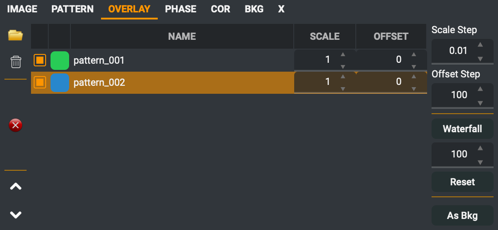
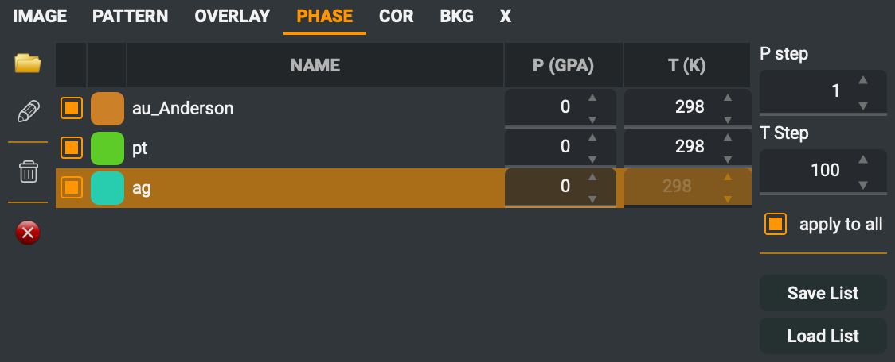
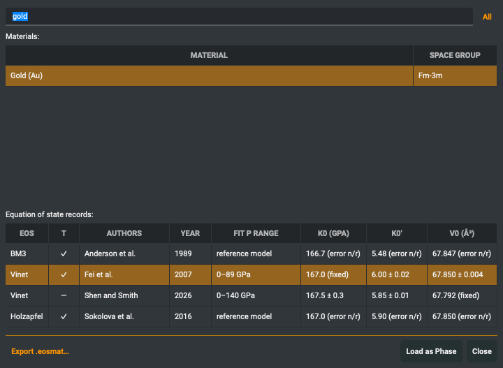
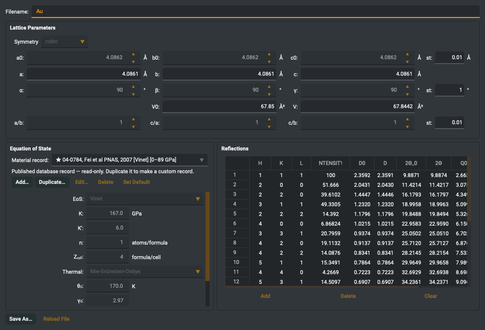
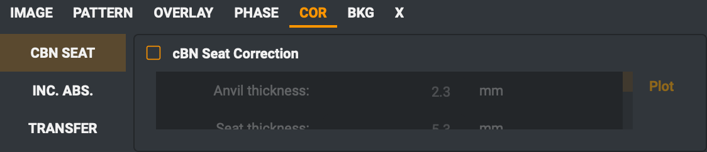
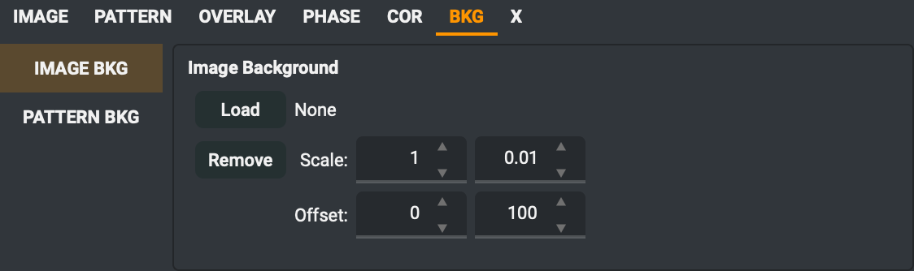
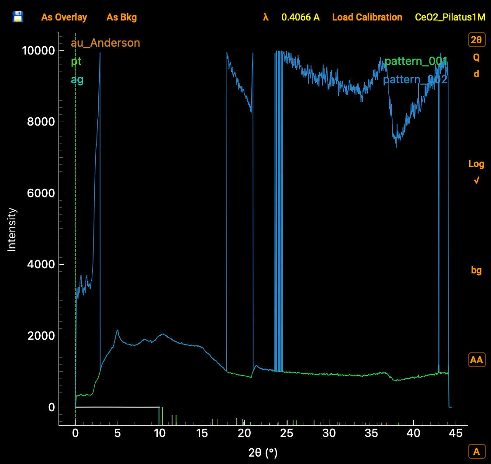
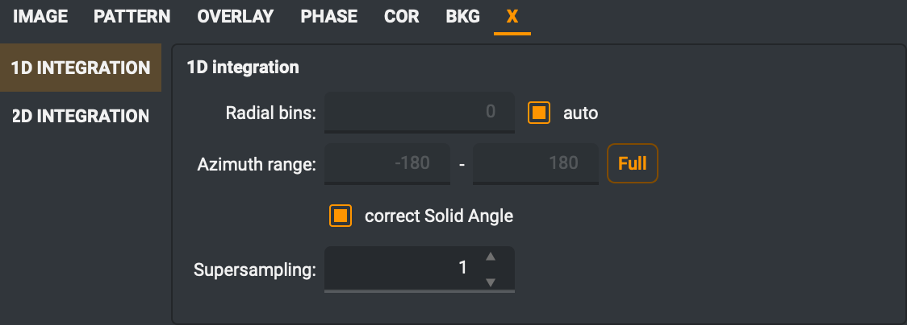
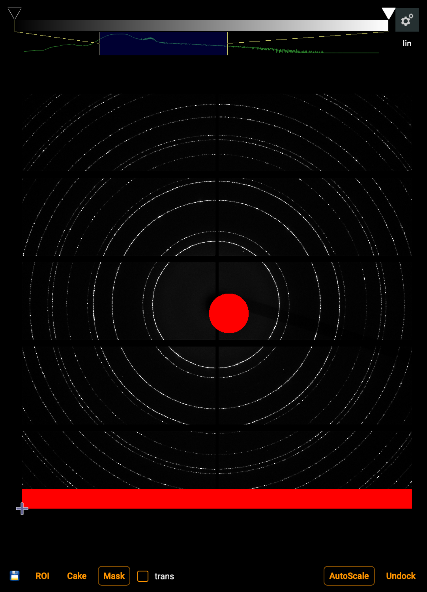

.. sectnum::
   :start: 4

==================
Integration Module
==================

The Integration module is the heart of Dioptas.
Here you can automatically integrate images to patterns, browse between images, compare multiple patterns,
perform background subtraction, apply intensity corrections, and compare peak positions to known phases.

.. figure:: images/integration_view.png
    :align: center
    :width: 600

    The Integration module of Dioptas.

The current image is displayed on the left with the integrated pattern shown on the lower right.
The control panel on the upper right has several tabs:

- **Image** — Loading, browsing, and batch processing images
- **Pattern** — Pattern file handling and auto-save settings
- **Overlay** — Loading and comparing multiple patterns
- **Phase** — Loading crystallographic phases and adjusting conditions
- **Cor** — Intensity corrections (cBN seat, detector absorption, transfer function)
- **Bkg** — Image and pattern background subtraction
- **X** — Integration options (binning, azimuth range, supersampling)

File Handling
-------------

Images and patterns can be loaded by clicking the **Load** button in the respective tabs.
Supported image formats include: *.tif*, *.tiff*, *.cbf*, *.edf*, *.img*, *.sfrm*, *.dm3*, *.xml*,
*.kccd*, *.mccd*, *.mar3450*, *.pnm*, *.spr*, *.spe*, HDF5 files, and other formats supported by fabio.
Pattern files should be 2-column files, optionally with a '#'-commented header.

Images loaded will be automatically integrated if a calibration is available (either from performing it in the
Calibration module or by loading a ``.poni`` file).

There are two modes for file browsing (using the **<** and **>** buttons):

*By Name*:
    Files are found based on the last digits in the filename.
    For example, the next file from *test_002.tif* is *test_003.tif*.

*By Time*:
    Files are sorted by creation time. This mode does not require numbers in filenames.

The **step** value controls how many files to skip when browsing.
The **autoprocess** checkbox monitors the current directory and automatically loads newly written images.
Dioptas checks the directory directly, so this also works when a detector writes to network storage and
file-system notifications are unavailable. A file is loaded only after its size has stopped changing, which
prevents Dioptas from opening a detector frame while it is still being written.

For multi-frame files (e.g., HDF5), a frame slider and position indicator allow navigation within the file.

Pattern Auto-Save
~~~~~~~~~~~~~~~~~

To automatically save integrated patterns, select an output folder in the **Pattern** tab by clicking "**...**"
and check the **autocreate** checkbox.
Patterns can be saved in five formats simultaneously:

- *.xy*: Two-column format with calibration header (default)
- *.xye*: Three-column format containing x, intensity, and propagated error
- *.chi*: Two-column Fit2D format
- *.dat*: Two-column format without header
- *.fxye*: Three-column GSAS/GSAS-II format containing propagated errors

The ``.xye`` and ``.fxye`` choices require **Calculate Poisson errors** in the *X* tab. If the
current integrated pattern has no errors, selecting either format offers to enable the option and
reintegrate the current image. Turning error calculation off also turns off both error-bearing
auto-save formats. The other formats remain available without error calculation.

Batch Processing
~~~~~~~~~~~~~~~~

In the **Image** tab, batch operations allow processing multiple images at once:

- **Integrate**: Integrate all files in a directory
- **Add**: Sum multiple images
- **Average**: Average multiple images
- **Save**: Save the current image

A progress dialog shows the integration status.

Overlays
--------

    Overlay controls in the integration window.

The Overlay tab allows loading and comparing multiple patterns:

- *Add*: Load one or more pattern files as overlays.
- *Delete*: Remove the selected overlay.
- *Clear*: Remove all overlays.

Each overlay in the list has:

- A **visibility checkbox** to show/hide it
- A **color button** to change its display color (click to open color chooser)
- An **editable name** (double-click to rename)

Adjust the **Scale** and **Offset** of overlays using the spin boxes on the right.
The **Step** fields control the spin box increment.

Right-clicking on an overlay provides a context menu with **Match intensity** to automatically scale the
overlay to match the active pattern's intensity range.

Set as Background
~~~~~~~~~~~~~~~~~

The **Set as Background** button uses the selected overlay as a background for pattern subtraction.
The background remains active for all subsequently integrated or loaded patterns.
If auto-save is enabled, background-subtracted patterns are saved in a ``bkg_subtracted`` subfolder.

Waterfall
~~~~~~~~~

The **Waterfall** button automatically offsets all overlays by multiples of the specified value,
creating a waterfall plot. The **Reset** button sets all overlay offsets to zero.

Phases
------

    Phase controls in the integration window.

Phase controls are similar to overlay controls:

- *Add*: Load a ``.jcpds``, ``.cif`` or ``.eosmat`` file. CIF files become
  normalized material records containing the complete lattice, formula, space
  group, crystallographic Z and atom sites; the original CIF text remains the
  lossless reflection source. A dialog asks for the **Intensity Cutoff** and
  **Minimum d-spacing** for reflections. Multiple files can be selected at
  once.
- *DB*: Browse the bundled, offline EoS material database. A selected material
  can be loaded directly as a phase; exporting it as ``.eosmat`` is optional
  and is intended for sharing or portability.
- *Edit*: Open the Phase Editor.
- *Delete*: Remove the selected phase.
- *Clear*: Remove all phases.
- *Save List / Load List*: Save or restore a list of loaded phases.

Each phase shows its material/mineral name and formula, pressure, temperature,
and (when available) a separate EoS reference selector. For example,
akimotoite is shown as ``Akimotoite (MgSiO3)`` while ``Siersch et al.`` stays
in the reference selector.
The **P** and **T** spin boxes adjust pressure and temperature.
Check **Apply to all phases** to change all phases simultaneously.
**Show in Pattern** controls whether P/T values appear in the phase legend.

Bundled EoS database
~~~~~~~~~~~~~~~~~~~~

    The bundled database shows a material's published EoS records and their provenance.

Click **DB** to search the equation-of-state material database shipped with Dioptas. Search accepts
material and mineral names, aliases, and formulas. Formula matching understands equivalent
stoichiometries and composition families: for example, ``MgFeO`` or ``MgFe`` can find a stored
mixed Mg-Fe oxide even when its formula uses decimal or integer-ratio subscripts. Exact matches are
listed first.

Select a material to see all its EoS records. The table reports the equation, whether a thermal
model is available, publication, experimental fit-pressure range, and the principal parameters.
The fit-pressure range is the range used to constrain the published EoS; it is **not** a
phase-stability range. A displayed ``±`` value is the uncertainty reported by the source.
``error n/r`` means that no verified error was recorded, not that the error is zero.

Select the appropriate record and click **Load as Phase** (or double-click it). Every record for
that material remains available afterward in the phase table's **Ref** selector, so its effect on
the calculated lines can be compared immediately. **Export .eosmat…** is only needed to share the
material or move it to a different Dioptas installation; loading from the database does not require
an export.

Phase Editor
~~~~~~~~~~~~

    Phase Editor with a published material record and its active EoS and thermal models.

The Phase Editor allows modifying phase parameters interactively.
All changes are immediately reflected in the pattern line positions.
You can edit:

- Symmetry
- Lattice parameters
- Equation of state parameters
- Individual reflections (h, k, l, intensity) by double-clicking in the table

The **EoS** selector shows only the parameters needed by the chosen equation. Available room-
temperature equations are second-, third- and fourth-order Birch-Murnaghan, Murnaghan, Vinet,
Modified Tait, second- through fourth-order Natural Strain, and Holzapfel. Existing JCPDS phases
continue to use their conventional third-order Birch-Murnaghan calculation.

The **Thermal** selector adds temperature dependence to the room-temperature equation. Choose
**Constant α, dK/dT** for the traditional JCPDS correction, a Mie-Grüneisen-Debye or
Mie-Grüneisen-Einstein model for a full thermal EoS, or the Sokolova et al. model when applicable.
The editor reveals only the parameters required by the selected model. If the active record has no
thermal model, changing the phase temperature does not move its reflections.

The **Material record** controls distinguish reusable, referenced EoS records
from temporary phase parameters:

- **Add** stores the current EoS as a custom record and opens its parameter,
  literature-reference, uncertainty, fixed-parameter and fit-range metadata.
- **Duplicate** makes a user-owned copy of any record.
- **Edit**, **Delete** and **Set Default** operate on user-owned records.
- Records loaded from the bundled database are read-only. Duplicate a
  published record before changing its values; this prevents edited numbers
  from continuing to carry the original publication attribution.

Records loaded from a user ``.eosmat`` file and records created from a CIF are
editable. **Set Default** marks the preferred user-owned record; save the material
as ``.eosmat`` or save the session as a project to retain that choice. Changes to
a loaded bundled phase never write into the application database; that database
is updated only through repository curation.

A "0" suffix indicates ambient-condition values; values without "0" correspond to the current P/T conditions.

- *Save As*: Save a complete reusable material as ``.eosmat``, use ``.jcpds``
  for legacy interoperability (advanced EoS/thermal metadata is not retained),
  or export the displayed reflection table as text. A ``.dio`` project remains
  the format for saving the complete analysis session.
- *Reload File*: Discard local changes and rebuild a JCPDS, CIF or ``.eosmat``
  phase from its source file. Bundled database materials have no source file
  and are already read-only, so this action is disabled for them.

The complete material, selected record, pressure, temperature and thermal state are also retained
inside a ``.dio`` project. Use a project when the goal is to resume the whole analysis rather than
to exchange one material.

Corrections
-----------

    Correction controls in the integration window.

The **Cor** tab provides three types of intensity corrections:

cBN Seat Correction
~~~~~~~~~~~~~~~~~~~

Calculates the theoretical transmitted intensity through a diamond and cBN seat assembly
(for diamond anvil cell experiments). Parameters:

- *Anvil d*: Diamond anvil thickness (mm)
- *Seat d*: cBN seat thickness (mm)
- *Inner Seat r*: Small opening radius of the cBN seat (mm)
- *Outer Seat r*: Large opening radius (mm)
- *Cell Tilt*: Cell tilt relative to the beam (degrees)
- *Tilt Rot*: Direction of the cell tilt (degrees)
- *Offset*: Sample offset from the center of the diamond–seat assembly (mm)
- *Offs. Rot*: Rotation of the center offset (degrees)
- *Anvil AL*: Diamond absorption length (μm)
- *Seat AL*: cBN seat absorption length (μm)

Click **Plot** to visualize the calculated absorption correction in the image view.

Oblique Incidence Angle Detector Absorption Correction
~~~~~~~~~~~~~~~~~~~~~~~~~~~~~~~~~~~~~~~~~~~~~~~~~~~~~~

Corrects for the detector's intensity response at large angles, where the path length through the
scintillator increases. Parameters:

- *Det. Thickness*: Scintillator thickness (mm)
- *Abs. Length*: Scintillator absorption length (μm)

Click **Plot** to visualize the correction.

.. note::
    This correction assumes all intensity comes from the calibrated sample position.
    It is not valid for air scattering or other diffuse background contributions.
    Remove such backgrounds before applying this correction.

Slab Sample Absorption Correction
~~~~~~~~~~~~~~~~~~~~~~~~~~~~~~~~~

Corrects for absorption in a flat slab sample (e.g., a pressed pellet or foil) in transmission geometry.
The correction accounts for the fact that scattering occurs at every depth within the sample, not just
at the surface.

The transmission factor is obtained by integrating over the scattering depth :math:`z` within the slab
of thickness :math:`t` (Busing & Levy, 1957; *Acta Cryst.* **10**, 180–182):

.. math::

    A^*(2\theta, \varphi) = \int_0^t \exp(-\mu_i \cdot z) \cdot \exp\bigl(-\mu_d \cdot (t - z)\bigr)\, dz

where the effective linear absorption coefficients along the incident and diffracted beam paths are:

.. math::

    \mu_i = \frac{\mu}{\cos \alpha_i}, \quad
    \mu_d = \frac{\mu}{\cos \alpha_d}

with :math:`\alpha_i` and :math:`\alpha_d` the angles between the respective beams and the slab normal.

This integral has a closed-form solution:

.. math::

    A^* = \begin{cases}
        \dfrac{\exp(-\mu_i t) - \exp(-\mu_d t)}{\mu_d - \mu_i} & \text{when } \mu_i \neq \mu_d \\[8pt]
        t \cdot \exp(-\mu_i t) & \text{when } \mu_i = \mu_d
    \end{cases}

The absorption coefficient :math:`\mu` is calculated automatically from the sample composition
and the calibration wavelength. Parameters:

- *Formula*: Chemical formula of the sample (e.g., ``CeO2``, ``Fe2O3``)
- *Density*: Material density in g/cm³ (optional for known materials)
- *Thickness*: Slab thickness in mm
- *Slab Tilt*: Tilt of the slab normal from the beam direction (degrees)
- *Slab Rotation*: Rotation of the tilt direction (degrees)

For a slab perpendicular to the beam (no tilt), the correction is azimuthally symmetric.
Tilting the slab breaks this symmetry, as different azimuthal directions have different path lengths.

Cylinder Sample Absorption Correction
~~~~~~~~~~~~~~~~~~~~~~~~~~~~~~~~~~~~~~

Corrects for absorption in a cylindrical sample (e.g., a capillary) in transmission geometry.
Unlike the slab correction, the path length through a cylinder varies across the illuminated
cross-section, so the transmission factor must be computed by numerically integrating over all
scattering points within the cylinder:

.. math::

    A^*(2\theta, \varphi) = \frac{1}{S} \iint \exp\bigl(-\mu \cdot (l_\text{in} + l_\text{out})\bigr)\, dA

where :math:`S` is the cross-sectional area, :math:`l_\text{in}` is the incident beam path to the
scattering point, and :math:`l_\text{out}` is the diffracted beam path from the scattering point to
the cylinder surface.

The integration is performed on a discrete grid of points inside the cylinder cross-section.
For performance, the correction is computed on a coarse :math:`(2\theta, \varphi)` grid and
interpolated to the full detector image.

Reference: Paalman, H. H. & Pings, C. J. (1962). *J. Appl. Phys.* **33**, 2635–2639.

Parameters:

- *Formula*: Chemical formula of the sample (e.g., ``SiO2``, ``LaB6``)
- *Density*: Material density in g/cm³ (optional for known materials)
- *Radius*: Sample cylinder radius (inner radius) in mm
- *Axis Tilt*: Tilt of the cylinder axis from vertical (degrees).
  0 = vertical (perpendicular to beam), 90 = along beam.
- *Axis Rotation*: Rotation of the tilt direction (degrees),
  following pyFAI's azimuthal convention.
- *Beam width*: Beam diameter in mm. 0 = pencil beam (default), larger values
  illuminate more of the cylinder cross-section

Optionally, a cylindrical container (e.g., glass capillary wall) can be included:

- *Container formula*: Chemical formula of the container material (e.g., ``SiO2``)
- *Container density*: Container density in g/cm³
- *Wall thickness*: Container wall thickness in mm

The container absorption is computed for both incident and diffracted beams passing
through the cylindrical shell between the sample radius and the outer radius.

Sphere Sample Absorption Correction
~~~~~~~~~~~~~~~~~~~~~~~~~~~~~~~~~~~~

Corrects for absorption in a spherical sample in transmission geometry. Due to the
spherical symmetry around the beam axis, the correction depends only on :math:`2\theta`
(not on azimuth), making it very efficient to compute. No orientation parameters are needed.

The beam width controls the illumination: a pencil beam (default, beam width = 0) integrates
along the beam path through the sphere center, which is appropriate for synchrotron experiments
(2–10 μm beam on ~1 mm ball). Larger beam widths integrate over more of the cross-section.

For the pencil beam case, the 1D integral along the beam path is:

.. math::

    A^*(2\theta) = \frac{1}{2R} \int_{-R}^{R} \exp\bigl(-\mu \cdot (l_\text{in}(x) + l_\text{out}(x, 2\theta))\bigr)\, dx

where :math:`l_\text{in}(x) = x + R` and
:math:`l_\text{out}(x, 2\theta) = -x \cos 2\theta + \sqrt{R^2 - x^2 \sin^2 2\theta}`.

Parameters:

- *Formula*: Chemical formula of the sample
- *Density*: Material density in g/cm³ (optional for known materials)
- *Radius*: Sphere radius in mm
- *Beam width*: Beam diameter in mm. 0 = pencil beam (default), larger values
  illuminate more of the sphere cross-section

Transfer Function Correction
~~~~~~~~~~~~~~~~~~~~~~~~~~~~~

Corrects for non-uniform detector response using a pair of images: an **original** flat-field image
and the detector's **response** image. The correction is the ratio of original to response.

Background Subtraction
----------------------

    Background controls in the integration window.

The **Bkg** tab provides two types of background subtraction:

Image Background
~~~~~~~~~~~~~~~~

Subtract a background image (e.g., dark frame or empty cell) from the raw image before integration.

- *Load*: Load an image as background.
- *Remove*: Remove the background image.
- *Scale*: Multiply the background intensity by this factor.
- *Offset*: Add this value to the background intensity.

The formula is: ``corrected = image - (scale × background + offset)``

After any change, the image is automatically reintegrated.

Pattern Background
~~~~~~~~~~~~~~~~~~

Automatically estimate and subtract the background from the integrated pattern. The estimation
uses the robust smoothing procedure of Brückner, followed by a Chebyshev polynomial fit:

1. **Brückner smoothing**: The pattern is repeatedly smoothed with a moving-average window.
   In each iteration, any point above the local window average is replaced by that average,
   while points below it are left unchanged. Peaks are thereby progressively suppressed
   from above, and the curve converges towards the background under the peaks.
   Before iterating, unusually intense points are clipped to reduce the influence of very
   strong peaks.
2. **Chebyshev fit**: A Chebyshev polynomial is fitted to the smoothed curve to obtain a
   continuous, smooth background, which is then subtracted from the original pattern.

The parameters in the **Bkg** tab control this procedure:

- *Smooth Width*: Width of the smoothing window (in pattern x-units). Larger values give
  smoother backgrounds but may cut into broad features.
- *Iterations*: Number of smoothing passes. More iterations pull the estimate further
  below the peaks.
- *Poly Order*: Chebyshev polynomial order for the background fit. Higher orders can follow
  more complex background shapes.
- *X-Range*: Min and max x-values for background estimation.
  **Note**: The subtracted pattern is only displayed within this range.
- *Inspect*: Show the original pattern and estimated background (red dashed line)
  side by side for parameter tuning. The x-range can be adjusted by dragging the yellow ROI lines.

Reference: Brückner, S. (2000). Estimation of the background in powder diffraction patterns
through a robust smoothing procedure. *J. Appl. Cryst.* **33**, 977–979.

.. _background_inspect_figure:

    Inspect mode in the pattern widget for background subtraction.

The **bg** and **I** buttons on the right side of the pattern widget provide quick access to
enable background subtraction and inspection mode, respectively.

Options (X Tab)
---------------

    Integration options.

1D Integration
~~~~~~~~~~~~~~

- *Number of Bins*: Manually set the number of integration bins, or check **auto** to let pyFAI decide.
- *Azimuth Range*: Restrict the azimuthal range for integration (in degrees).
- *Solid Angle Correction*: Enable/disable solid angle correction during integration.
- *Calculate Poisson Errors*: Calculate propagated counting-statistics errors during
  1D integration. This is disabled by default because it requires additional compute
  time. When enabled, the errors are retained with the current pattern for ``.xye`` and
  ``.fxye`` export; saving does not repeat the integration. Error calculation uses the
  active integration engine (pyFAI or, when enabled and available, Dioptrin).
- *Supersampling*: Split each pixel into n² sub-pixels for finer integration.
  Can reduce peak widths for large pixels but may produce artifacts. Use with caution.

2D Cake Integration
~~~~~~~~~~~~~~~~~~~

- *Azimuth Bins*: Number of azimuthal bins for the cake image.
- *Azimuth Range*: Restrict the azimuthal range of the cake.
- *Integral Width*: Width of the azimuthal integration range when clicking on the cake.

Quick Actions
-------------

The Image and Pattern widgets have quick-action buttons for common operations.

Image Quick Actions
~~~~~~~~~~~~~~~~~~~

    Quick actions in the image widget.

Located at the bottom/top of the image widget:

- *ROI*: Show a draggable region of interest — only the area inside the ROI is integrated.
- *Cake*: Switch to cake (2D-integrated) view showing intensity vs. azimuth.
- *Image*: Switch back to the raw image view.
- *Mask*: Toggle the mask for integration (mask must be defined in the Mask module first).
- *trans*: Toggle transparent mask display.
- *bg*: Show the background-subtracted image (requires a loaded background).
- *AutoScale*: Automatically adjust the intensity range for each new image.
- *Undock/Dock*: Detach the image widget into a separate window (useful for multi-monitor setups).

Pattern Quick Actions
~~~~~~~~~~~~~~~~~~~~~

Located at the top and right side of the pattern widget:

**Top buttons:**

- *Save Image*: Save the current view as PNG or TIFF.
- *Save Pattern*: Save the pattern as .xy, .png, or .svg.
- *As Overlay*: Add the active pattern to overlays.
- *As Bkg*: Add the active pattern as a background overlay.
- *Load Calibration*: Load a .poni calibration file.

**Right-side buttons:**

- :math:`2\theta`, :math:`Q`, :math:`d` — Select the integration unit.
- *Log*, *Sqrt* — Toggle logarithmic or square-root y-axis scaling.
- *bg*, *I* — Enable background subtraction and inspection mode.
- *AA* — Toggle anti-aliasing (disable for better performance with many overlays).
- *A* — Auto-range: automatically scale to show the full pattern when new data is loaded.
