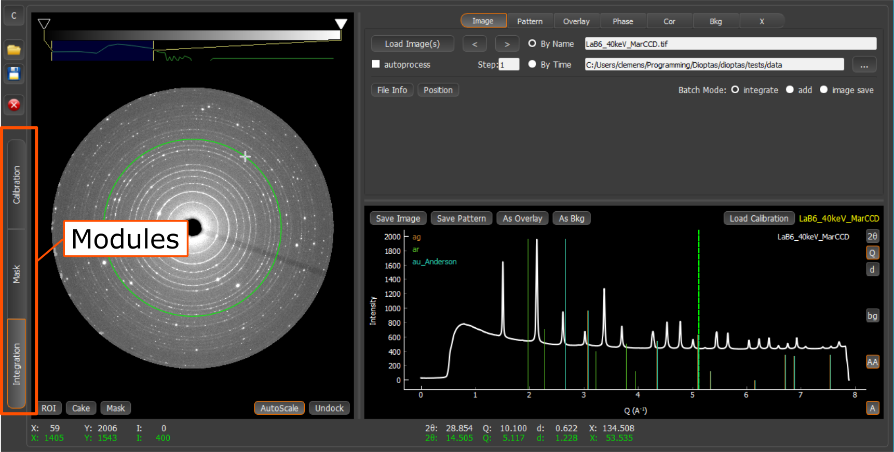

.. sectnum::

Introduction
============

Dioptas is a GUI program for fast integration and exploration of 2D X-ray diffraction Images.
It provides the capability of calibrating, integrating, creating masks, showing multiple pattern overlays and display
phases line positions.
The basis of the integration and calibration algorithm is the pyFAI_ library.
The usage of pyFAI_ allows integration times on the order of 80 milliseconds and calibration of every possible detector
geometry.

.. _pyFAI: https:\\github.com\silx-kit\pyFAI

Dioptas has three different modules which can all be accessed by the tab indicators on the left side of the user
interface: **Calibration, Mask, Integration**.

The Calibration module enables you to calibrate the detector geometry.
Within the Mask module you can select regions you want to exclude from the image integration and the Integration module
is the heart of Dioptas, where you will spend most time for data exploration.
It shows both, the image and integrated pattern, and one can overlay different pattern and show line position of phases.

    Location of module selectors.

Mouse Interaction in the Image and Pattern Widgets
--------------------------------------------------

The basis for data exploration in are the image and pattern widgets available in all 3 modules.
The interaction with these widgets is tried to be as intuitive as possible, without extra need of different selection
modes.
All widgets support to following mouse commands:

- *Left Click:*
    Action depends on the module you are in.
    In the calibration view it will search for peaks.
    In the Mask view it is the primary tool for creating the geometric objects used to build up the mask and in the
    integration view it draws a line at the current two theta value.

- *Left Drag:*
    Zooms into the selected area.
    It will try to scale images accordingly, but will not perfectly zoom in to the selected area, because pixels are
    kept as square objects on the screen.

- *Right Click (Command+Right Click on Mac):*
    Zoom out.

- *Right Double Click (Command + Right Double Click on Mac):*
    Completely zoom out.

- *Mouse Wheel:*
    Zoom in and zoom out based on the current cursor position.

Image Color Scale and Contrast
------------------------------

Every image widget has a color bar and a histogram either on the side of the image (Mask module and Calibration Module)
or on the top (integration module).
The colors of the color bars can be easily adjusted.
You can switch to a completely different color-scale by right clicking the color bar.
This creates a pop-up where one of the predefined color scales can be selected.
The position of the individual colors can be adjusted by dragging the triangle of this color.
Further the colors can be changed completely by double clicking (left) it, which will pop up a color chooser.
It is in addition also possible to add a complete new color by double clicking (left) next to the color bar.
The histogram next to the color bar shows the intensity distribution of the loaded image on a log scale.
The sliders two lines define the scaling of the image in the image view.
Please feel free to adjust their position by dragging them.