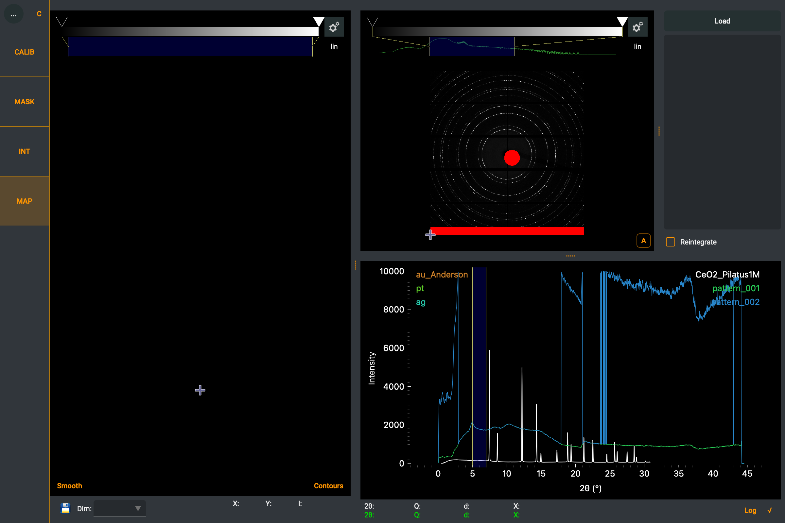

.. sectnum::
   :start: 6

==========
Map Module
==========

The Map module enables visualization and exploration of 2D diffraction data collected on a spatial grid.
This is useful for experiments where samples are scanned in a grid pattern (e.g., X-Y mapping) and you
want to explore how diffraction patterns vary across the sample.

    The Map module of Dioptas.

Overview
--------

The Map module has a four-panel layout:

- **Map image** (left): Shows a 2D map where each pixel represents an integrated diffraction pattern.
  The pixel value is derived from a selected feature of the pattern (e.g., intensity in a region of interest).
- **Image view and control panel** (upper right): the raw diffraction image of the currently
  selected map position, beside two tabs — *Points*, for loading the images and arranging them on
  the grid, and *Layers*, for what each point measures. When the panel is too narrow for both,
  the image moves into the tabs (leftmost) instead of squeezing the tables.
- **Pattern plot** (lower right): Shows the integrated pattern for the currently selected map position.

Loading Map Data
----------------

To create a map, you need a set of integrated diffraction patterns arranged on a grid.
The Map module can integrate multiple image files and arrange them based on their positions.

The map dimensions are calculated automatically from the number of files and the expected grid size.

A map can also be built while it is still being measured — see `Live maps`_.

Visualization Options
---------------------

Several options are available to enhance the map visualization:

- **Smooth**: Apply smoothing to the map image for better visualization. The slider controls
  the smoothing level, which is automatically adjusted based on zoom level.
- **Contours**: Overlay contour lines on the map image using cubic interpolation.
  The slider controls the number of contour levels.
- **AutoScale**: Automatically adjust the image intensity range.
- **Layer**: Select which of the map's layers is drawn (see `Windows and layers`_).
- **Live**: Keep appending the scan's images as the beamline writes them (see `Live maps`_).
- **Grid…**: Opens the layout dialog — grid size, serpentine scans, mirroring and the
  dropped-frame repair (see `Arranging the points`_).

Interacting with the Map
-------------------------

- **Left click** on the map image to select a position. The corresponding diffraction image and
  integrated pattern are displayed in the other panels.
- The pattern plot supports **Log** and **Sqrt** scaling buttons for the y-axis.
- A region of interest (ROI) can be selected on the pattern to define which feature is used to
  generate the map image values.

Windows and layers
------------------

Each window of the pattern produces one **layer** of the map, and the *Windows* table in the
*Layers* tab decides what that window is reduced to:

- **Sum**, **Sum − bkg**, **Mean**, **Max** — the raw counts in the window. A plain sum also tracks
  how much sample the beam went through, so it often maps thickness as much as phase.
- **Peak area** — the same, after subtracting the straight line joining the window edges. Use this
  when the background varies across the scan.
- **Peak pos.** — the intensity-weighted centre of the peak. Mapped over a scan this is a
  d-spacing map, and therefore a strain map.
- **Peak FWHM** — the full width at half maximum, which tracks grain size and mosaicity.

None of these fit a peak: area integrates the background-subtracted profile, position is its
intensity-weighted centre, and the FWHM interpolates the half-maximum crossings. The **? button**
beside each table opens the exact definitions.

Overlays enter through expressions: ``ovl(overlay, window)`` is the overlay put through a window —
interpolated onto the map's axis and reduced with that window's range, value kind and background
setting — so ``A - ovl(bkg_empty)`` maps the difference to a reference pattern (with one window in
the expression the window argument can be left out). Overlay names that are not plain words go in
quotes: ``ovl('my background', A)``. A window the overlay does not cover reads blank rather than an
extrapolated value.

Add a second window with the **+** button beside the table; every window is drawn in the pattern plot in its own colour
and can be dragged there. That colour is shown as a swatch in the row — click it to pick another —
and the row, its "show" marker and the region under the mouse all use it, so it is always clear
which region belongs to which window. **Computed layers**, added with the **+** beside their table, combine the windows by name — ``A/B`` for a phase
fraction, ``(A-B)/(A+B)`` for a contrast that survives changes in illumination. Only arithmetic on
the layer names, numbers, the functions ``abs``, ``sqrt``, ``log``, ``log10``, ``exp``,
``clip``, ``minimum`` and ``maximum``, and the ``ovl()`` overlay reference are allowed.

The two tables share the tab through a splitter and each scrolls inside its own half, so
adding a window never pushes the computed layers out of reach. Drag the divider to give one
of them more room.

Only one layer is drawn at a time. **Which one is chosen by the radio button in the leftmost column
of either table**, next to the window it belongs to; the **Layer** box below the map does the same
and is what to use when the map panel is undocked or shown in the integration view. A newly added
window or computed layer is shown straight away.

Arranging the points
--------------------

The list in the *Points* tab has one row per **grid cell**, not per file, so a gap in the scan is
visible. Rows can be dragged to rearrange the map, and the icon buttons beside the list — also
available by right-clicking a row — act on the selected cell. Hover any of them for what it does:

- **Move up** / **Move down** (arrows) — moves the selected cell one place along the scan order,
  for finer control than dragging. Works on blanks as well as on points.
- **Insert blank cell** (dashed cell with a plus) — for a frame the beamline dropped. Without it
  every point after the gap sits one cell too early, which produces a plausible-looking but wrong
  map.
- **Remove blank cell** (dashed cell with a minus) — only for blanks with points after them: the
  grid keeps its cell count, so a trailing blank belongs to the grid size and is dropped by
  shrinking the grid instead.
- **Leave point out** / **Put it back** (cell struck through / ticked) — for a saturated frame or a
  beam dump. The point's cell closes up in the map (the freed cell joins the blanks at the end),
  while its row in the list stays where it was, struck through; putting it back restores its place.
  Clicking a blank cell in the map selects its row in the list, where the blank actions live.

Buttons that cannot apply to the selected cell fade out.

The **Grid…** button below the map opens the layout options: a quick pick of the grids that fit the
loaded points exactly, the number of rows and columns (any grid with room for every point, not only
exact factorizations of the point count), **Serpentine (snake) scan** for
scans where every other row ran in the opposite direction, swapping the fast and slow axis, and
mirroring. **Check filename numbering** looks for numbers missing from the file names and inserts a
blank for each one, which repairs a dropped frame in a single click.

Blank cells are drawn transparent and are left out of the colour scale.

Live maps
---------

The **Live** button beside *Load* grows the map while the beamline is still writing it. The folder
of the loaded files is watched — by listing it about once a second, which unlike file-system events
also works on the network storage beamlines use — and every new image is integrated and appended as
soon as it is fully written. The grid keeps its number of columns and gains rows as the scan
progresses; blanks, rearrangements and excluded points survive; the newest point is selected as it
arrives, so the pattern plot always shows the latest frame.

The intended workflow: load the first image (or images) of the scan as a map, then switch Live on.
Numbered files written between the two — the scan does not wait — are picked up automatically.

Which files count as part of the scan is decided by their name: a new file must share the loaded
files' name up to the running number (loading ``scan_001.tif`` admits ``scan_002.tif`` and
``scan_020.tif``), so a calibration image or another scan writing into the same folder is left
alone, whatever its extension and numbering. Catch-up additionally requires the number to continue
past the highest one loaded.

The grid is not guessed from the files — set the scan's width (or its full size) in **Grid…**, at
any point before or during the scan. The grid then keeps its number of columns and gains rows as
points arrive; a grid set to the full scan size fills in cell by cell. Until a width is set, the
map grows with the columns the initial load happened to have — nothing is lost, and the points
rearrange the moment the real width is entered.

A file that cannot be read is skipped with a log entry rather than ending the session. Loading a
different map or switching the configuration turns Live off.

Reintegration
-------------

The **Reintegrate** checkbox allows re-running the integration for all map positions when integration
parameters change (e.g., unit, number of bins, mask). This is useful for exploring how different
integration settings affect the map.

Project Persistence
-------------------

The Map module state is saved in Dioptas project files (``.dio``), so maps can be restored
when reopening a project.
