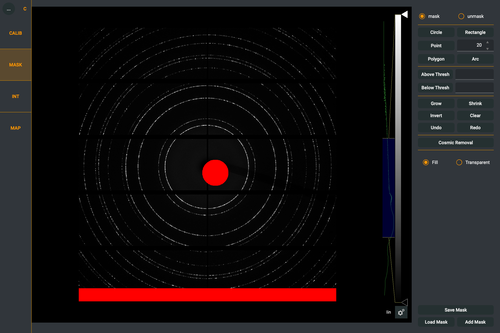

.. sectnum::
   :start: 3

Mask Creation
=============

In the Mask module, areas can be defined which will be excluded from integration or calibration.
There are several geometric shapes available, as well as threshold-based masking and automatic cosmic ray removal.
All tools are available on the right control panel.
You can choose between **Mask** mode (add to mask) and **Unmask** mode (remove from mask) using the toggle
at the top of the control panel.

    The Mask module of Dioptas.

Selection Tools
---------------

Click on a geometry tool to select it — an orange border shows which one is active.
All geometric shapes are created using left clicks:

- *Circle*:
    The first click defines the center and the second click defines the radius.

- *Rectangle*:
    The first click defines one corner and the second the opposite corner.

- *Point*:
    Each click masks an area the size of the circle floating around the mouse pointer.
    The brush size can be changed via the value next to the **Point** button or using the **Q** and **W** keys.

- *Polygon*:
    Subsequent clicks define vertices of the polygon.
    A double-click closes the polygon (adding the double-click position as the last vertex).

- *Arc*:
    The first 3 clicks define a circular arc and the 4th click defines the arc width.

Threshold Masking and Cosmic Removal
------------------------------------

For threshold masking, enter the desired value next to the **Above** or **Below** button and click the button.
This will mask all pixels with intensity above or below the specified threshold, respectively.
Threshold masking respects the current mask/unmask mode.

**Cosmic removal** is an automatic procedure that detects and masks cosmic ray artifacts in the image.
This procedure can take a considerable amount of time.

Control Buttons
---------------

- *Grow*:
    Expands the current mask by one pixel in all directions.

- *Shrink*:
    Contracts the current mask by one pixel in all directions.

- *Invert*:
    Inverts the mask — unmasked areas become masked and vice versa.

- *Clear*:
    Removes the entire mask.

- *Undo/Redo*:
    Undo or redo mask actions. Up to 50 actions can be undone.
    Keyboard shortcuts: **Z** for undo, **Y** for redo.

File Handling
-------------

- *Save Mask*:
    Saves the current mask as a TIFF file (1 for masked pixels, 0 for unmasked).
    Also supports .edf and .npy formats.

- *Load Mask*:
    Loads a previously saved mask, replacing the current one.

- *Add Mask*:
    Loads a mask and combines it with the current mask (logical OR).

Mask Plugins
------------

Dioptas supports mask plugins for automated masking (e.g., dead pixel maps, hot pixel detection).
If any plugins are installed, they appear in the control panel between the Cosmic Removal button
and the visibility toggles. Each plugin has a checkbox to enable/disable it and an optional
settings button.

See :doc:`mask_plugins` for details on writing and installing plugins.
